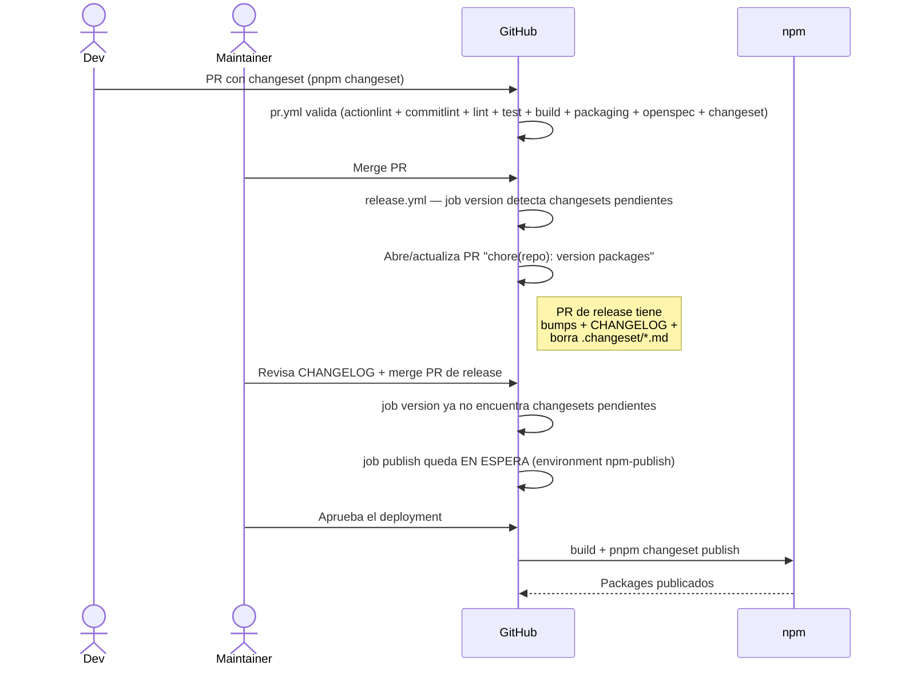

# Contributing

Gracias por considerar contribuir a `design-system`. Este documento describe el flujo de trabajo del repo: convenciones de commits, versionado, gobernanza de cambios y calidad.

## Prioridades del repo

Toda contribución se evalúa contra estas prioridades, en orden:

1. **Aplicar buenas prácticas.**
2. **Diseños/arquitecturas que escalen ordenado.**
3. **Mantenibilidad** vía estándares y convenciones claras.

Frente a una disyuntiva, no elegir por velocidad: proponer 2-3 opciones evaluadas con pros/contras.

## Setup inicial

```bash
nvm use            # Node de .nvmrc
pnpm install       # instala todo el monorepo
```

`pnpm install` ejecuta `husky` automáticamente (vía `prepare` script) y deja los hooks de git listos.

## Conventional Commits

Todos los commits siguen [Conventional Commits](https://www.conventionalcommits.org/). El hook `commit-msg` valida el formato con commitlint y rechaza mensajes malformados.

### Formato

```
<type>(<scope>): <subject>

[body opcional]

[footer opcional, ej. BREAKING CHANGE]
```

### Tipos válidos

`feat`, `fix`, `chore`, `docs`, `style`, `refactor`, `perf`, `test`, `build`, `ci`, `revert`.

### Scopes habituales

`tokens`, `components`, `playground`, `repo`, `ci`, `docs`, `deps`.

### Ejemplos

✅ Válidos:

- `feat(tokens): add neutral color scale`
- `fix(components): correct button focus ring`
- `chore(repo): update pnpm to 9.5.0`
- `docs(architecture): add ADR-005`

❌ Inválidos:

- `arreglo cosas` — sin tipo
- `feat: ` — subject vacío
- `Feat(tokens): Add stuff` — case incorrecto

### Subject

- En minúsculas, sin punto final.
- Imperativo presente (ej. "add", no "added" ni "adds").
- ≤ 72 caracteres.

## Pre-commit hooks

Sobre archivos staged, antes de cada commit corre:

- `eslint --fix` en `*.{ts,tsx,js,jsx,mjs,cjs}`
- `prettier --write` en `*.{ts,tsx,js,jsx,mjs,cjs,json,md,yaml,yml,css,scss,html}`

Si hay errores no auto-fixables, el commit se aborta.

Para correr lint/format manualmente:

```bash
pnpm lint            # ESLint en todo
pnpm format          # auto-formatea con Prettier
pnpm format:check    # verifica formato sin escribir
```

## Versionado con Changesets

Cada PR que afecta una librería publicable (cualquier cosa en `packages/*`) **requiere un changeset**. El último gate de `pr.yml` lo verifica y bloquea el merge si falta.

### Crear un changeset

```bash
pnpm changeset
```

El CLI interactivo pregunta:

1. **Qué packages cambiaron** (selección con espacio).
2. **Tipo de bump**:
   - `patch`: bug fix sin cambios de API (`0.2.0 → 0.2.1`).
   - `minor`: feature nueva backward-compatible (`0.2.0 → 0.3.0` en pre-1.0; `1.0.0 → 1.1.0` en post-1.0).
   - `major`: breaking change (`0.2.0 → 0.3.0` en pre-1.0; `1.0.0 → 2.0.0` en post-1.0).
3. **Descripción** del cambio, que va al CHANGELOG generado.

Genera un archivo en `.changeset/<random-name>.md`. **Commiteá ese archivo junto con tus cambios** en el PR.

**Idioma**: los changesets y los CHANGELOG se escriben en **español**, igual que el resto del repo ([D-018](docs/product/decisiones.md)). El histórico del `0.2.0` quedó en inglés y se acepta como está — no se reescribe.

### Lockstep: tokens y components versionan juntos

Desde [ADR-015](docs/architecture/adr/ADR-015-versionado-lockstep.md), `@romanmartinidev/tokens` y `@romanmartinidev/components` están configurados como `fixed` en Changesets: **comparten una única versión**. Consecuencias prácticas al escribir un changeset:

- El bump que elegís **aplica al par**, no a un package suelto: si marcás un `minor` en `tokens`, `components` sube igual aunque no lo hayas tocado.
- El peer de tokens dentro de components es un **rango plano pre-1.0** (`>=0.1.0 <1.0.0`) con `onlyUpdatePeerDependentsWhenOutOfRange`, lo que evita que cada bump de tokens fuerce un major en components.
- Elegí el bump por el **impacto mayor** de los dos packages.

### Pre-1.0

Mientras los packages no lleguen a 1.0, respetamos semver pero entendiendo que la superficie API puede cambiar. La política definitiva se acuerda al primer release.

### Release (mantenedores)

El release está automatizado vía GitHub Actions + Changesets (ver [`ADR-006`](docs/architecture/adr/ADR-006-estrategia-ci-cd.md)). El mantenedor NO publica manualmente — todo pasa por el workflow `release.yml`. Ver sección [CI / Release](#ci--release) más abajo.

> **Aprobación por versión**: el veto de publicación fue levantado el 2026-07-28 ([D-028](docs/product/decisiones.md)), pero eso no habilita publicar en automático. Cada release requiere la aprobación explícita del PO en el environment `npm-publish` ([ADR-022](docs/architecture/adr/ADR-022-gate-aprobacion-publish-npm.md)).

## CI / Release

El repo usa **dos workflows de GitHub Actions** que se autovalidan en cada PR y orquestan releases automáticos vía Changesets.

### Workflow `pr.yml` — Validación en cada PR

**Trigger**: `pull_request` apuntando a `main`.

Valida en orden:

1. **actionlint** — fallo: hay un error de sintaxis o de expresión en un workflow. Reproducilo local (ver [Lint de workflows](#lint-de-workflows)).
2. **commitlint** — fallo: algún commit del PR no cumple Conventional Commits. Corré `pnpm exec commitlint --from origin/main --to HEAD --verbose` y reescribí el mensaje.
3. `pnpm format:check` — fallo: corré `pnpm format` y commiteá.
4. `pnpm lint` — fallo: corré `pnpm lint --fix` y revisá los errores no auto-fixables.
5. `pnpm typecheck` — fallo: hay un error de tipos en un spec o en una story (ver [Typecheck](#typecheck)).
6. `pnpm -r build` — fallo: revisá el error de build localmente con el mismo comando.
7. `pnpm test:coverage` — fallo: o rompiste un test, o la cobertura cayó bajo el piso (ver [Cobertura](#cobertura)).
8. `pnpm -F playground build-storybook` — fallo: la configuración de Storybook está rota, un addon no existe o un import no resuelve. **No detecta un template de story desactualizado** (los templates son strings evaluados en runtime): para eso están el typecheck de las stories y, más adelante, los interaction tests.
9. `pnpm verify:packaging` — fallo: el artefacto emitido no cumple el contrato de publicación ([ADR-021](docs/architecture/adr/ADR-021-estrategia-publicacion-packages.md)).
10. `pnpm size` — fallo: un entrypoint publicable superó su presupuesto de tamaño (ver [Presupuesto de bundle](#presupuesto-de-bundle)).
11. `pnpm exec openspec validate --all` — fallo: corré `pnpm openspec validate --all` localmente y arreglá la spec/change.
12. **Changeset enforcement** — fallo: el PR toca `packages/*` sin agregar un changeset. Corré `pnpm changeset` y agregá el archivo generado al PR.

> El step 12 se **omite** en el PR autogenerado `changeset-release/main`: ese PR bumpea `packages/*/package.json` después de consumir los changesets, así que por construcción no puede satisfacer el gate. También se omite si el PR solo toca `README.md` o `CHANGELOG.md` de un package.

Si cualquier step falla, el PR queda con check rojo y NO debería mergearse (la branch protection lo bloquea, ver más abajo).

### Workflow `release.yml` — Release con Changesets

**Trigger**: `push` a `main` (cualquier merge dispara el workflow).

Tiene **dos jobs**, uno por modo ([ADR-022](docs/architecture/adr/ADR-022-gate-aprobacion-publish-npm.md)):

**Job `version` — Hay changesets pendientes en `.changeset/`**:

Abre o actualiza un PR titulado `chore(repo): version packages` con:

- Bumps de versión en `packages/*/package.json`.
- CHANGELOG.md actualizado por package afectado.
- Los archivos `.changeset/*.md` consumidos eliminados.

Corre sin aprobación: la operación es reversible y ocurre en cada merge.

**Job `publish` — No quedan changesets pendientes** (típicamente porque el PR de release recién se mergeó):

Buildea y ejecuta `pnpm changeset publish`. **Queda en espera de aprobación** del required reviewer del environment `npm-publish` antes de correr: publicar es irreversible (npm no permite republicar una versión). Nada llega a npm sin ese OK explícito.

> El workflow invoca `changeset publish` directo y no un script del root: el script `release` fue **eliminado** a propósito para que no exista un camino de publish manual de un comando. Para versionar, el script se llama `changeset:version` (no `version`, que colisiona con un builtin de pnpm).

### Flujo completo de release



### Branch protection (acción del mantenedor)

Las branch protection rules se configuran **manualmente** en GitHub UI (Settings → Branches → Add rule para `main`). El mantenedor debe aplicar este checklist:

- [x] **Require pull request reviews before merging** — minimum 1 reviewer (vacío si trabajás solo, pero igual te obliga a abrir PR).
- [x] **Require status checks to pass before merging**:
  - [x] Require branches to be up to date before merging.
  - [x] Status checks required: `Validate` (job del workflow `pr.yml`).
- [x] **Require linear history** (recomendado — fuerza rebase merge en lugar de merge commits).
- [x] **Do not allow bypassing the above settings**.
- [x] **Restrict who can push to matching branches** — solo el mantenedor.
- [x] **Restrict pushes that create matching branches** — bloquear creación de branches `main` desde forks.
- [ ] **Allow force pushes**: NO marcar.
- [ ] **Allow deletions**: NO marcar.

Estas reglas garantizan que ningún PR llegue a `main` sin pasar `pr.yml` y que `main` nunca se reescribe destructivamente.

### Environment `npm-publish` (acción del mantenedor)

El job de publish de `release.yml` declara `environment: npm-publish`. Ese environment se crea **manualmente** en GitHub UI (Settings → Environments → New environment), y es lo que convierte la publicación a npm en una acción que requiere aprobación explícita ([ADR-022](docs/architecture/adr/ADR-022-gate-aprobacion-publish-npm.md), [D-018](docs/product/decisiones.md)(b)).

> ⚠️ **Hasta que el environment exista con su reviewer, el gate NO protege nada.** GitHub crea implícitamente un environment desconocido en el primer run que lo referencia — sin reviewers y sin avisar. El workflow no falla: publica. La garantía la da esta configuración, no el YAML.

**Estado: configurado el 2026-07-29** ([D-029](docs/product/decisiones.md)). Este checklist queda como referencia para reconstruirlo o replicarlo.

- [x] Crear el environment llamado exactamente **`npm-publish`**.
- [x] **Required reviewers**: agregar al mantenedor. Sin esto el environment es decorativo.
- [x] **Desmarcar "Allow administrators to bypass configured protection rules"** (viene marcado por defecto). Si queda activo, el mantenedor —que es admin— puede saltarse su propio gate, y el control vuelve a ser decorativo.
- [x] **Deployment branches**: restringir a `main`.
- [x] Agregar **`NPM_TOKEN`** como secret **del environment** (Environment secrets), no del repositorio.
- [x] Si `NPM_TOKEN` ya existía como repository secret, **borrarlo** de ahí: mientras siga a nivel repo, cualquier job puede leerlo.
- [ ] **`Prevent self-review`**: dejar **sin marcar** mientras haya un solo mantenedor — exige que el aprobador sea distinto de quien disparó el run, lo que bloquearía todo release. Activarlo al sumar un segundo mantenedor.

> **Requiere repo público o plan Pro/Team.** GitHub no ofrece deployment protection rules en repos privados con plan Free: la sección directamente no aparece. Es una de las razones por las que el repo es público (D-029).

### Secrets requeridos (acción del mantenedor)

| Secret          | Dónde va                                 | Cómo obtener                                                           | Permisos requeridos                                |
| --------------- | ---------------------------------------- | ---------------------------------------------------------------------- | -------------------------------------------------- |
| **`NPM_TOKEN`** | Secret del **environment `npm-publish`** | **Granular Access Token** de npmjs.com (no classic) — ver receta abajo | `Read and write` sobre el scope `@romanmartinidev` |

Cómo generarlo: npmjs.com → Access Tokens → **Generate New Token → Granular**.

- **Bypass two-factor authentication (2FA)**: ✅ marcar. Es lo que en los tokens clásicos hacía el tipo "Automation"; sin esto, con 2FA activo el publish desde CI falla pidiendo OTP.
- **Packages and scopes**: `Read and write` sobre el **scope completo**, no sobre los dos packages sueltos — un token granular no puede apuntar a un package que todavía no existe en npm, así que el scope cubre los publicables futuros.
- **Organizations**: `No access`. El publish no administra la organización.
- **Allowed IP ranges**: dejar **vacío**. Los runners hosted de GitHub no tienen rangos acotables de forma práctica; declarar `0.0.0.0/0` es lo mismo que no restringir, pero aparentando un control que no existe.
- **Expiration**: el plazo más largo disponible. Cuando expira, el release falla con un error de autenticación de npm que no dice "token vencido" — conviene anotarse la fecha.

**`GITHUB_TOKEN`** lo provee GitHub Actions automáticamente, no requiere setup.

Si `NPM_TOKEN` falta, el job de publish fallará con error de autenticación de npm.

> **A futuro**: [ci-cd-11] propone migrar a **trusted publishing vía OIDC**, que elimina el token de larga vida por completo. `changesets/action` ya lo soporta — usa OIDC cuando no encuentra `NPM_TOKEN`. Pendiente de decisión del PO.

### Lint de workflows

`actionlint` **corre como primer step de `pr.yml`**: un error de sintaxis o de expresión en un workflow deja el PR en rojo. Para reproducirlo local antes de pushear:

```bash
# Vía Docker (sin instalar nada):
docker run --rm -v "$(pwd):/repo" -w /repo rhysd/actionlint:latest -color

# O instalando localmente:
brew install actionlint  # macOS
go install github.com/rhysd/actionlint/cmd/actionlint@latest  # Go
actionlint .github/workflows/*.yml
```

CI usa una **versión fija** verificada por checksum SHA256 antes de ejecutarse (ver `ACTIONLINT_VERSION` en `pr.yml`); si tu binario local es de otra versión el veredicto puede diferir.

> No le pases `.github/actions/**/action.yml`: actionlint solo entiende el schema de workflow y reporta una composite action como inválida por no declarar `on` ni `jobs`.

## Cobertura

CI corre la suite con cobertura (`pnpm test:coverage`) y **falla el PR si la cobertura cae por debajo del piso** de cualquier package. No es una advertencia.

```bash
pnpm test:coverage                          # los tres workspaces
pnpm -F @romanmartinidev/components test:coverage   # uno solo
```

Pisos vigentes, declarados en el `vitest.config.ts` de cada workspace:

| Workspace                     | Statements | Branches | Functions | Lines |
| ----------------------------- | ---------- | -------- | --------- | ----- |
| `@romanmartinidev/components` | 93         | 76       | 96        | 93    |
| `playground`                  | 23         | 49       | 17        | 25    |
| `@romanmartinidev/tokens`     | —          | —        | —         | —     |

**El piso es un trinquete: solo sube.** Se fijó en la cobertura realmente medida al instalarlo (2026-07-29) menos 1 punto de margen, para absorber la variación de instrumentación sin dejar el pipeline al borde. Si tu PR sube la cobertura de forma estable, subí el piso con él. **Bajarlo requiere decisión explícita del product owner** — no lo bajes para destrabar un PR: agregá el test que falta.

Dos aclaraciones sobre la tabla:

- **`tokens` no declara umbrales a propósito.** El package no expone módulos TypeScript (su fuente son JSON y su build es Style Dictionary), así que no hay código instrumentable y la cobertura mide `0/0`. Un umbral ahí no podría fallar nunca. Su contrato de calidad se verifica sobre el **artefacto emitido**, no sobre líneas cubiertas.
- **Los números del `playground` son un piso de no-regresión, no una vara de calidad.** Es un laboratorio interno no publicable ([D-001](docs/product/decisiones.md)) y su showcase es mayormente markup declarativo.

## Typecheck

El build de las librerías excluye `*.spec.ts` y `*.stories.ts` por exigencia del Angular Package Format, y el runner de tests los transpila **sin verificar tipos**. El script `typecheck` cubre ese hueco y corre como step bloqueante en CI:

```bash
pnpm typecheck                              # los tres workspaces
pnpm -F @romanmartinidev/components typecheck
```

Sin él, renombrar un input de componente deja specs y stories rotas en tipos con CI en verde.

> **Las 22 stories de `components` se typechequean desde el `playground`**, vía `.storybook/tsconfig.json` — es donde vive la configuración de Storybook, y duplicarla en el package no aportaría nada. Si tocás una story y querés verificarla sin correr todo: `pnpm -F playground typecheck`.

**Gap conocido**: los archivos de configuración del repo (`vitest.config.ts`, `sd.config.mjs`) no están en ningún tsconfig y hoy nadie los typechequea. Requiere `@types/node` por workspace; queda como ítem propio.

## Presupuesto de bundle

CI mide el peso **gzip** de cada entrypoint publicable sobre el `dist` que ese mismo PR construyó, y **falla el PR si alguno supera su techo**. No es una advertencia.

```bash
pnpm -r build   # el presupuesto mide el dist: sin build no hay nada que medir
pnpm size
```

Techos vigentes, declarados en `.size-limit.json` del root:

| Entrypoint                                           | Medido (2026-07-31) | Techo    |
| ---------------------------------------------------- | ------------------- | -------- |
| `@romanmartinidev/components` — principal (`.`)      | 46.10 kB            | 48.41 kB |
| `@romanmartinidev/components` — `./router`           | 2.00 kB             | 2.11 kB  |
| `@romanmartinidev/tokens` — `./css`                  | 6.03 kB             | 6.15 kB  |
| `@romanmartinidev/tokens` — principal (`.`)          | 5.69 kB             | 5.81 kB  |
| `@romanmartinidev/tokens` — themes (los tres juntos) | 1.00 kB             | 1.05 kB  |

> El techo de `components` subió de 45.38 a 48.41 kB con la entrada de `DsSlider` (`aaa-044`): el
> kit pasó de 43.22 a 46.10 kB medidos (+2.88 kB del componente, coherente con el costo típico de
> ~2.3 kB más los tres extras opt-in). Los medidos de `tokens` se refrescaron en la misma corrida
> (+33 vars de `component.slider.*`) sin mover sus techos: siguen por debajo.

Los valores son **kB decimales (1000 B)**, que es como los reporta `size-limit` — no KiB.

**El techo solo se mueve por decisión explícita del product owner**, y el PR que lo mueve deja registrada la razón. Se fijó midiendo el `dist` construido el 2026-07-31 y aplicando un margen del **5%** ([D-031](docs/product/decisiones.md)), con la regla `medido × 1.05` redondeado hacia arriba al siguiente múltiplo de 10 B.

Dos cosas que conviene saber antes de que te frene:

- **Un componente nuevo va a hacerte subir el techo, y está bien.** Un componente real del kit cuesta ~2.3 kB gzip (medido) contra 2.16 kB de margen: el margen es deliberadamente más chico que un componente, para que el gate no pueda absorber uno entero en silencio. Subir el techo en el PR que agrega el componente es el mecanismo, no un obstáculo — deja registrado cuánto pesó.
- **Lo que se mide es el bundle completo, no lo que paga un consumidor con tree-shaking.** El gate detecta que el kit engordó; no mide el costo de importar un solo componente. Medir eso exigiría bundlear con Angular como external, y queda como candidato futuro.

Si el gate falla, la salida te dice qué entrypoint excedió, cuánto pesa y cuál es el límite, y el job imprime esta misma política a continuación. Antes de subir el techo, verificá que el peso extra es algo que querías agregar: si no agregaste nada que lo justifique, ahí el gate está haciendo su trabajo y lo que hay que buscar es la dependencia o el import que entró sin querer.

> **Si estás agregando un componente**, no esperes a que CI te frene: `/ds:add-component` corre `pnpm size` en su validación de cierre, justamente para que el ajuste del techo sea un paso del flujo y no una interrupción. El motivo de fondo es que un gate que se pone rojo de forma rutinaria enseña a subir el número sin mirar — y ahí deja de avisar del crecimiento que **no** era deliberado, que es para lo que existe.

## Cambios significativos: OpenSpec

Si tu cambio es:

- Una nueva librería.
- Un refactor mayor que afecta ≥2 packages.
- Cambio de tooling base (build, lint, versionado).

→ **arranca como propuesta en `openspec/changes/`** antes de codear:

```bash
# El comando exacto depende del scaffolding instalado.
# Estructura mínima:
openspec/changes/<change-name>/
├── proposal.md      # Intent + Scope + Approach
├── design.md        # decisiones técnicas + opciones evaluadas
├── tasks.md         # checklist binaria
└── specs/<capability>/spec.md   # deltas con G/W/T
```

Validar con `pnpm openspec validate --changes`. Cambios triviales (typo, fix local) **no** requieren propuesta OpenSpec.

La convención de IDs (`aaa-NNN`) y el próximo ID disponible viven en [`openspec/README.md`](openspec/README.md).

## Decisiones arquitectónicas: ADRs

Toda decisión one-way door (irreversible) o que afecta ≥2 packages genera un ADR en formato MADR en `docs/architecture/adr/`. Los ADRs son **inmutables** una vez aceptados: para cambiar una decisión, crear un nuevo ADR que referencia al anterior.

Ver [`docs/architecture/adr/README.md`](docs/architecture/adr/README.md) para el formato.

## Flujo de PR

1. Branch desde `main`: `feat/<descripcion>` o `fix/<descripcion>`.
2. Commits siguiendo Conventional Commits.
3. Si afecta una lib publicable: agregar changeset (`pnpm changeset`).
4. Si es cambio significativo: linkear la propuesta OpenSpec correspondiente.
5. `pnpm lint` y `pnpm format:check` deben pasar.
6. Tests deben pasar (`pnpm test`).
7. Abrir PR con descripción clara: qué cambia, por qué, qué validaste.

## Fuentes de verdad

Si tenés dudas sobre dónde mirar:

| Pregunta                       | Fuente                                          |
| ------------------------------ | ----------------------------------------------- |
| ¿Qué debe hacer el sistema?    | `openspec/specs/`                               |
| ¿Qué cambios están en curso?   | `openspec/changes/`                             |
| ¿Por qué se decidió X?         | `docs/architecture/adr/`                        |
| ¿Cómo está organizado el repo? | `docs/architecture/README.md`                   |
| ¿Por qué se prioriza X?        | `docs/product/` (épicas, HUs, decisiones D-XXX) |
| ¿Qué está en cola?             | `docs/backlog/BACKLOG.md`                       |
| ¿Cómo trabajo?                 | este archivo                                    |
| ¿Cómo arranco?                 | [`README.md`](README.md)                        |

Ver también [`CLAUDE.md`](CLAUDE.md) para el contrato con Claude Code.
