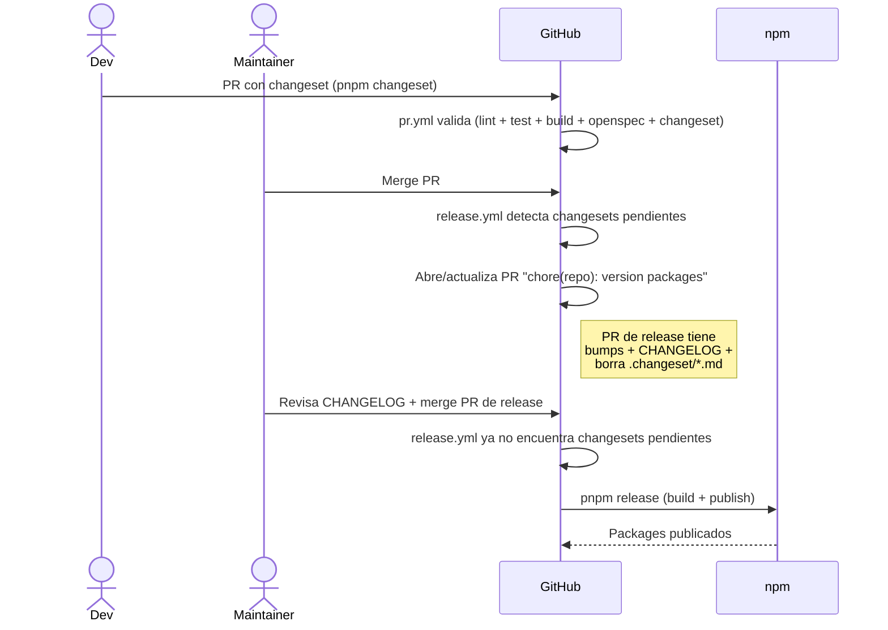

# Contributing

Gracias por considerar contribuir a `design-system`. Este documento describe el flujo de trabajo del repo: convenciones de commits, versionado, gobernanza de cambios y calidad.

## Prioridades del repo

Toda contribución se evalúa contra estas prioridades, en orden:

1. **Aplicar buenas prácticas.**
2. **Diseños/arquitecturas que escalen ordenado.**
3. **Mantenibilidad** vía estándares y convenciones claras.

Frente a una disyuntiva, no elegir por velocidad: proponer 2-3 opciones evaluadas con pros/contras.

## Setup inicial

```bash
nvm use            # Node de .nvmrc
pnpm install       # instala todo el monorepo
```

`pnpm install` ejecuta `husky` automáticamente (vía `prepare` script) y deja los hooks de git listos.

## Conventional Commits

Todos los commits siguen [Conventional Commits](https://www.conventionalcommits.org/). El hook `commit-msg` valida el formato con commitlint y rechaza mensajes malformados.

### Formato

```
<type>(<scope>): <subject>

[body opcional]

[footer opcional, ej. BREAKING CHANGE]
```

### Tipos válidos

`feat`, `fix`, `chore`, `docs`, `style`, `refactor`, `perf`, `test`, `build`, `ci`, `revert`.

### Scopes habituales

`tokens`, `components`, `playground`, `repo`, `ci`, `docs`, `deps`.

### Ejemplos

✅ Válidos:

- `feat(tokens): add neutral color scale`
- `fix(components): correct button focus ring`
- `chore(repo): update pnpm to 9.5.0`
- `docs(architecture): add ADR-005`

❌ Inválidos:

- `arreglo cosas` — sin tipo
- `feat: ` — subject vacío
- `Feat(tokens): Add stuff` — case incorrecto

### Subject

- En minúsculas, sin punto final.
- Imperativo presente (ej. "add", no "added" ni "adds").
- ≤ 72 caracteres.

## Pre-commit hooks

Sobre archivos staged, antes de cada commit corre:

- `eslint --fix` en `*.{ts,tsx,js,jsx,mjs,cjs}`
- `prettier --write` en `*.{ts,tsx,js,jsx,mjs,cjs,json,md,yaml,yml,css,scss,html}`

Si hay errores no auto-fixables, el commit se aborta.

Para correr lint/format manualmente:

```bash
pnpm lint            # ESLint en todo
pnpm format          # auto-formatea con Prettier
pnpm format:check    # verifica formato sin escribir
```

## Versionado con Changesets

Cada PR que afecta una librería publicable (cualquier cosa en `packages/*`) **requiere un changeset**.

### Crear un changeset

```bash
pnpm changeset
```

El CLI pregunta:

1. Qué packages cambiaron.
2. Tipo de bump por package: `patch` (fix), `minor` (feature), `major` (breaking).
3. Descripción del cambio (va al CHANGELOG generado).

Esto crea un archivo en `.changeset/` que se commitea junto con tus cambios.

### Pre-1.0

Mientras los packages no lleguen a 1.0, respetamos semver pero entendiendo que la superficie API puede cambiar. La política definitiva se acuerda al primer release.

### Release (mantenedores)

El release está automatizado vía GitHub Actions + Changesets (ver [`docs/architecture/adr/ADR-006-estrategia-ci-cd.md`](docs/architecture/adr/ADR-006-estrategia-ci-cd.md)). El mantenedor NO publica manualmente — todo pasa por el workflow `release.yml`. Ver sección [CI / Release](#ci--release) más abajo.

## CI / Release

El repo usa **dos workflows de GitHub Actions** que se autovalidan en cada PR y orquestan releases automáticos vía Changesets.

### Workflow `pr.yml` — Validación en cada PR

**Trigger**: `pull_request` apuntando a `main`.

Valida en orden:

1. `pnpm format:check` — fallo: corré `pnpm format` y commiteá.
2. `pnpm lint` — fallo: corré `pnpm lint --fix` y revisá los errores no auto-fixables.
3. `pnpm -r build` — fallo: revisá el error de build localmente con el mismo comando.
4. `pnpm -r test` — fallo: corré `pnpm test` localmente y arreglá los specs.
5. `openspec validate --all` — fallo: corré `openspec validate --all` localmente y arreglá la spec/change.
6. **Changeset enforcement** — fallo: el PR toca `packages/*` sin agregar un changeset. Corré `pnpm changeset` y agregá el archivo generado al PR.

Si cualquier step falla, el PR queda con check rojo y NO debería mergearse (la branch protection lo bloquea, ver más abajo).

### Workflow `release.yml` — Release con Changesets

**Trigger**: `push` a `main` (cualquier merge dispara el workflow).

Tiene dos modos según el estado del repo:

**Modo 1 — Hay changesets pendientes en `.changeset/`**:

El workflow abre o actualiza un PR titulado `chore(repo): version packages` con:

- Bumps de versión en `packages/*/package.json`.
- CHANGELOG.md actualizado por package afectado.
- Los archivos `.changeset/*.md` consumidos eliminados.

**Modo 2 — No hay changesets pendientes** (típicamente porque el PR de release recién se mergeó):

El workflow ejecuta `pnpm release` (build + publish) y publica los packages cambiados a npm.

### Flujo completo de release



### Cómo agregar un changeset

```bash
pnpm changeset
```

El CLI interactivo te pregunta:

1. **Qué packages cambiaron** (selección con espacio).
2. **Tipo de bump**:
   - `patch`: bug fix sin cambios de API (`0.1.0 → 0.1.1`).
   - `minor`: feature nueva backward-compatible (`0.1.0 → 0.2.0` en pre-1.0; `1.0.0 → 1.1.0` en post-1.0).
   - `major`: breaking change (`0.1.0 → 0.2.0` en pre-1.0; `1.0.0 → 2.0.0` en post-1.0).
3. **Descripción** del cambio para el CHANGELOG.

Genera un archivo en `.changeset/<random-name>.md`. **Commiteá ese archivo junto con tus cambios** en el PR.

### Branch protection (acción del mantenedor)

Las branch protection rules se configuran **manualmente** en GitHub UI (Settings → Branches → Add rule para `main`). El mantenedor debe aplicar este checklist:

- [x] **Require pull request reviews before merging** — minimum 1 reviewer (vacío si trabajás solo, pero igual te obliga a abrir PR).
- [x] **Require status checks to pass before merging**:
  - [x] Require branches to be up to date before merging.
  - [x] Status checks required: `Validate` (job del workflow `pr.yml`).
- [x] **Require linear history** (recomendado — fuerza rebase merge en lugar de merge commits).
- [x] **Do not allow bypassing the above settings**.
- [x] **Restrict who can push to matching branches** — solo el mantenedor.
- [x] **Restrict pushes that create matching branches** — bloquear creación de branches `main` desde forks.
- [ ] **Allow force pushes**: NO marcar.
- [ ] **Allow deletions**: NO marcar.

Estas reglas garantizan que ningún PR llegue a `main` sin pasar `pr.yml` y que `main` nunca se reescribe destructivamente.

### Secrets requeridos (acción del mantenedor)

En GitHub Settings → Secrets and variables → Actions → New repository secret:

| Secret          | Cómo obtener                                                                                                     | Permisos requeridos                    |
| --------------- | ---------------------------------------------------------------------------------------------------------------- | -------------------------------------- |
| **`NPM_TOKEN`** | `npm token create --read-only=false --cidr=0.0.0.0/0` (o vía UI: npmjs.com → Access Tokens → Generate New Token) | Publish sobre scope `@romanmartinidev` |

**`GITHUB_TOKEN`** lo provee GitHub Actions automáticamente, no requiere setup.

Si `NPM_TOKEN` falta, el workflow `release.yml` fallará en el step de publish con error de autenticación de npm.

### Lint local de workflows (opcional)

Antes de commitear cambios a `.github/workflows/`, podés validar el YAML con [`actionlint`](https://github.com/rhysd/actionlint):

```bash
# Vía Docker (sin instalar nada):
docker run --rm -v "$(pwd):/repo" -w /repo rhysd/actionlint:latest -color

# O instalando localmente:
brew install actionlint  # macOS
go install github.com/rhysd/actionlint/cmd/actionlint@latest  # Go
actionlint .github/workflows/*.yml
```

No es obligatorio (no está en el workflow CI), pero evita errores de sintaxis YAML antes del push.

## Cambios significativos: OpenSpec

Si tu cambio es:

- Una nueva librería.
- Un refactor mayor que afecta ≥2 packages.
- Cambio de tooling base (build, lint, versionado).

→ **arranca como propuesta en `openspec/changes/`** antes de codear:

```bash
# El comando exacto depende del scaffolding instalado.
# Estructura mínima:
openspec/changes/<change-name>/
├── proposal.md      # Intent + Scope + Approach
├── design.md        # decisiones técnicas + opciones evaluadas
├── tasks.md         # checklist binaria
└── specs/<capability>/spec.md   # deltas con G/W/T
```

Validar con `openspec validate --changes`. Cambios triviales (typo, fix local) **no** requieren propuesta OpenSpec.

## Decisiones arquitectónicas: ADRs

Toda decisión one-way door (irreversible) o que afecta ≥2 packages genera un ADR en formato MADR en `docs/architecture/adr/`. Los ADRs son **inmutables** una vez aceptados: para cambiar una decisión, crear un nuevo ADR que referencia al anterior.

Ver [`docs/architecture/adr/README.md`](docs/architecture/adr/README.md) para el formato.

## Flujo de PR

1. Branch desde `main`: `feat/<descripcion>` o `fix/<descripcion>`.
2. Commits siguiendo Conventional Commits.
3. Si afecta una lib publicable: agregar changeset (`pnpm changeset`).
4. Si es cambio significativo: linkear la propuesta OpenSpec correspondiente.
5. `pnpm lint` y `pnpm format:check` deben pasar.
6. Tests deben pasar (`pnpm test`).
7. Abrir PR con descripción clara: qué cambia, por qué, qué validaste.

## Fuentes de verdad

Si tenés dudas sobre dónde mirar:

| Pregunta                       | Fuente                        |
| ------------------------------ | ----------------------------- |
| ¿Qué debe hacer el sistema?    | `openspec/specs/`             |
| ¿Qué cambios están en curso?   | `openspec/changes/`           |
| ¿Por qué se decidió X?         | `docs/architecture/adr/`      |
| ¿Cómo está organizado el repo? | `docs/architecture/README.md` |
| ¿Cómo trabajo?                 | este archivo                  |
| ¿Cómo arranco?                 | [`README.md`](README.md)      |

Ver también [`CLAUDE.md`](CLAUDE.md) para el contrato con Claude Code.
