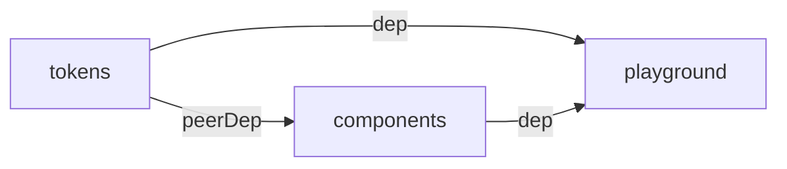

# Arquitectura — agent-design-sistem

**Fuente única de verdad agregada** de la arquitectura del repo. Sintetiza todas las decisiones tomadas en los ADRs y los contratos definidos en specs. Para detalle de cada decisión con opciones evaluadas, ir a los ADRs linkeados.

> Si querés **replicar esta arquitectura en otro repo desde cero**, ver [PLAYBOOK.md](PLAYBOOK.md).

---

## Tabla de contenidos

1. [Visión general](#visión-general)
2. [Stack tecnológico](#stack-tecnológico)
3. [Principios arquitectónicos](#principios-arquitectónicos)
4. [Estructura del monorepo](#estructura-del-monorepo)
5. [Reglas de dependencia](#reglas-de-dependencia)
6. [Arquitectura de tokens (@romanmartinidev/tokens)](#arquitectura-de-tokens-romanmartinidevtokens)
7. [Arquitectura de components (@romanmartinidev/components)](#arquitectura-de-components-romanmartinidevcomponents)
8. [Arquitectura del playground (apps/playground)](#arquitectura-del-playground-appsplayground)
9. [Convenciones del repo](#convenciones-del-repo)
10. [Pipeline de releases](#pipeline-de-releases)
11. [Catálogo de ADRs](#catálogo-de-adrs)
12. [Catálogo de Specs](#catálogo-de-specs)
13. [Catálogo de Changes](#catálogo-de-changes)

---

## Visión general

`agent-design-sistem` es un **monorepo `pnpm`** que aloja librerías de **arquitectura frontend** publicables a npm bajo el scope `@romanmartinidev`, junto con una aplicación de prueba (`apps/playground`) que actúa como laboratorio de validación y plataforma de prototipado.

```mermaid
flowchart TB
    subgraph packages [packages — publicables a npm]
        T[tokens<br/>@romanmartinidev/tokens<br/>Style Dictionary 4]
        C[components<br/>@romanmartinidev/components<br/>Angular 21 + ng-packagr]
    end
    subgraph apps [apps — internas]
        P[playground<br/>Angular 21 zoneless<br/>+ Storybook 10]
    end
    T -- workspace:* (peerDep CSS via vars) --> C
    T -- workspace:* (CSS @import) --> P
    C -- workspace:* (TS import) --> P
```

## Stack tecnológico

| Dominio                     | Tecnología                             | Versión                   | ADR/Spec                                                                                             |
| --------------------------- | -------------------------------------- | ------------------------- | ---------------------------------------------------------------------------------------------------- |
| **Package manager**         | pnpm workspaces                        | 9.x                       | [ADR-001](adr/ADR-001-monorepo-pnpm-workspaces.md)                                                   |
| **Runtime**                 | Node                                   | 22 LTS (≥22.12)           | [ADR-001](adr/ADR-001-monorepo-pnpm-workspaces.md)                                                   |
| **Lenguaje**                | TypeScript                             | 5.9                       | —                                                                                                    |
| **Framework UI**            | Angular                                | 21.2                      | [ADR-004](adr/ADR-004-arquitectura-components.md), [ADR-005](adr/ADR-005-arquitectura-playground.md) |
| **Change detection**        | Zoneless                               | Angular 21.2 (estable)    | [ADR-005](adr/ADR-005-arquitectura-playground.md)                                                    |
| **Build tokens**            | Style Dictionary                       | 4.3+                      | [ADR-003](adr/ADR-003-arquitectura-design-tokens.md)                                                 |
| **Build libs Angular**      | ng-packagr (APF)                       | 21.x                      | [ADR-004](adr/ADR-004-arquitectura-components.md)                                                    |
| **Build apps Angular**      | @angular/build (esbuild)               | 21.2                      | —                                                                                                    |
| **Testing**                 | Vitest 4 + @analogjs/vitest-angular    | 4.x + 2.5                 | [ADR-004](adr/ADR-004-arquitectura-components.md)                                                    |
| **Visualización**           | Storybook 10                           | 10.4 + @storybook/angular | [ADR-005](adr/ADR-005-arquitectura-playground.md)                                                    |
| **Versionado de packages**  | Changesets                             | 2.x                       | [ADR-002](adr/ADR-002-conventional-commits-changesets.md)                                            |
| **Convenciones de commits** | Conventional Commits + commitlint      | 21.x                      | [ADR-002](adr/ADR-002-conventional-commits-changesets.md)                                            |
| **Pre-commit hooks**        | Husky + lint-staged                    | 9.x + 17.x                | [ADR-002](adr/ADR-002-conventional-commits-changesets.md)                                            |
| **Lint**                    | ESLint flat config + typescript-eslint | 10.x + 8.x                | [ADR-001](adr/ADR-001-monorepo-pnpm-workspaces.md)                                                   |
| **Format**                  | Prettier                               | 3.x                       | —                                                                                                    |
| **Specs y gobernanza**      | OpenSpec                               | 1.3+                      | —                                                                                                    |
| **ADRs**                    | MADR                                   | —                         | [adr/README.md](adr/README.md)                                                                       |

## Principios arquitectónicos

Las decisiones del repo se evalúan contra estos principios, en estricto orden de prioridad:

1. **Aplicar buenas prácticas.** Si una solución funciona pero contradice una práctica establecida en el ecosistema, no se elige sin justificación explícita.
2. **Escalar ordenado.** La estructura debe sostener crecimiento (más libs, más componentes, más colaboradores) sin reescritura.
3. **Mantenibilidad.** Estándares y convenciones explícitos para que cualquier dev (o IA) pueda entender qué hay, dónde está y por qué.

## Estructura del monorepo

```
agent-design-sistem/
├── packages/                  # Librerías publicables (npm)
│   ├── tokens/                # @romanmartinidev/tokens
│   └── components/            # @romanmartinidev/components
├── apps/
│   └── playground/            # App Angular interna (no publicable)
├── docs/
│   ├── architecture/          # Fuente de verdad arquitectónica
│   │   ├── README.md          # Este archivo
│   │   ├── PLAYBOOK.md        # Cómo replicar la arq en otro repo
│   │   ├── adr/               # ADRs en formato MADR
│   │   └── decisions-log.md   # Índice cronológico de ADRs
│   └── bootstrap-plan.md      # Plan operativo del bootstrap (temporal)
├── openspec/
│   ├── IDS.md                 # Tabla maestra CHG/SPC ↔ nombre ↔ path
│   ├── specs/                 # Contratos testables (SPC-NNN-*)
│   └── changes/               # Propuestas de cambio (CHG-NNN-*)
├── .changeset/                # Cambios pendientes de release
├── .husky/                    # pre-commit + commit-msg hooks
├── package.json               # Root del monorepo
├── pnpm-workspace.yaml
├── .nvmrc, .npmrc, .editorconfig, .gitignore, .prettierrc, .prettierignore
├── eslint.config.js
├── commitlint.config.js
├── lint-staged.config.js
├── CLAUDE.md                  # Contrato Claude ↔ repo
├── CONTRIBUTING.md            # Flujo de trabajo
├── README.md
└── LICENSE
```

## Reglas de dependencia

- `tokens` no depende de nada del monorepo.
- `components` depende de `tokens` como **peerDependency** (`workspace:*`).
- `playground` depende de `tokens` y `components` como **dependencies** (`workspace:*`).
- Nunca: dependencia de `tokens` o `components` hacia `playground`.
- Nunca: dependencia circular entre packages.



**Contrato testable**: requirement _"Grafo de dependencias internas es un DAG"_ en [SPC-001 monorepo-structure](../../openspec/specs/SPC-001-monorepo-structure/spec.md).

## Arquitectura de tokens (`@romanmartinidev/tokens`)

**Decisión formal**: [ADR-003 — Arquitectura de design tokens](adr/ADR-003-arquitectura-design-tokens.md).
**Contrato testable**: [SPC-002 design-tokens-package](../../openspec/specs/SPC-002-design-tokens-package/spec.md).

### Jerarquía (primitives → semantic → component → theme)

```
packages/tokens/src/
├── primitives/    # Valores crudos sin semántica (color.blue.500, dimension.16, shadow.md)
├── semantic/      # Tokens con intención (bg.primary, text.muted, border.default, space.md, shadow.focus)
├── component/     # Tokens específicos por componente (button.bg, modal.shadow)
└── theme/         # Overrides de tokens semantic (dark, brand-a, brand-b)
```

**Reglas de referencia**:

- `semantic` referencia `primitives` (no al revés).
- `component` referencia `semantic` o `primitives` (no `theme`).
- `theme` **solo redefine** tokens existentes en `semantic` (no introduce nuevos).
- Sin referencias circulares.

### Build con Style Dictionary 4

```bash
pnpm -F @romanmartinidev/tokens build
```

Output:

- `dist/tokens.css` — variables CSS en `:root`
- `dist/tokens.js` + `dist/tokens.d.ts` — constantes JS/TS
- `dist/themes/<theme>.css` — un CSS por theme bajo selector `[data-theme="..."]` o `[data-brand="..."]`

### Prefix CSS: `--ds-*`

**Parte del contrato API público**. Cambiarlo es BREAKING y exige ADR que reemplace al ADR-003.

```css
:root {
  --ds-color-blue-500: #3b82f6;
  --ds-semantic-color-bg-primary: var(--ds-color-blue-500);
}
```

### Theming por cascada CSS + atributos HTML

```html
<html data-theme="dark" data-brand="a">
  <!-- toda la cascada usa dark + brand-a, combinables -->
</html>
```

Cada theme se importa opt-in:

```ts
import '@romanmartinidev/tokens/css';
import '@romanmartinidev/tokens/themes/dark';
```

### Surface de exports granular

```jsonc
{
  ".": { "import": "./dist/tokens.js", "types": "./dist/tokens.d.ts" },
  "./css": "./dist/tokens.css",
  "./themes/dark": "./dist/themes/dark.css",
  "./themes/brand-a": "./dist/themes/brand-a.css",
  "./themes/brand-b": "./dist/themes/brand-b.css",
}
```

`sideEffects: ["./dist/*.css", "./dist/themes/*.css"]` permite tree-shaking del JS preservando CSS.

## Arquitectura de components (`@romanmartinidev/components`)

**Decisión formal**: [ADR-004 — Arquitectura de @romanmartinidev/components](adr/ADR-004-arquitectura-components.md).
**Contrato testable**: [SPC-003 components-package](../../openspec/specs/SPC-003-components-package/spec.md).

### Build con ng-packagr (Angular Package Format)

```bash
pnpm -F @romanmartinidev/components build
```

Sin `angular.json` propio. ng-packagr corre standalone con `ng-package.json`. Produce `dist/fesm2022/*.mjs` + `dist/types/*.d.ts` + `dist/package.json`.

### Estructura interna: flat por componente

```
packages/components/src/
├── public-api.ts          # Barrel — surface pública
└── lib/
    └── <name>/            # Una carpeta por componente
        ├── <name>.component.ts
        ├── <name>.component.css
        ├── <name>.component.spec.ts
        ├── <name>.stories.ts   # Co-ubicada (Storybook desde apps/playground)
        └── index.ts            # Re-export interno
```

### Standalone + signals + new APIs

```ts
@Component({
  selector: 'rmd-button',
  standalone: true,
  changeDetection: ChangeDetectionStrategy.OnPush,
  template: `<button [disabled]="disabled()" (click)="handleClick($event)"><ng-content /></button>`,
  styleUrl: './button.component.css',
})
export class ButtonComponent {
  variant = input<'primary' | 'secondary' | 'ghost'>('primary');
  disabled = input<boolean>(false);
  clicked = output<MouseEvent>();
}
```

- `input()` / `output()` / `model()` signals (no `@Input()` / `@Output()`).
- Sin `NgModule`s.

### Selector prefix `rmd-`

**Parte del contrato API público**. Coexiste con `--ds-*` (CSS variables) — son namespaces ortogonales.

### Naming convention

| Pieza    | Convención            | Ejemplo               |
| -------- | --------------------- | --------------------- |
| Carpeta  | kebab-case            | `button/`             |
| Archivo  | `<name>.component.ts` | `button.component.ts` |
| Class    | `<Name>Component`     | `ButtonComponent`     |
| Selector | `rmd-<name>`          | `rmd-button`          |

### Styles: CSS plain + tokens via vars

Archivos `.css` (no SCSS). Consumo exclusivo de tokens via `var(--ds-*)`. Sin valores hardcoded.

### peerDependencies

- `@angular/core@^21`, `@angular/common@^21`
- `@romanmartinidev/tokens: workspace:*` (Changesets lo reescribe a versión semver al publicar)

### Surface

`exports` en root `package.json` apunta a `dist/fesm2022/...` y `dist/types/...` (ng-packagr genera el `dist/package.json` con `exports` propios al buildear).

## Arquitectura del playground (`apps/playground`)

**Decisión formal**: [ADR-005 — Arquitectura del playground](adr/ADR-005-arquitectura-playground.md).
**Contrato testable**: [SPC-004 playground-app](../../openspec/specs/SPC-004-playground-app/spec.md).

### Rol

Laboratorio interno. **No se publica** (`"private": true`). Sirve como:

- Validador end-to-end del consumo de las libs en una app Angular real.
- Host de **Storybook 10** con stories co-ubicadas en `packages/components/`.

### Zoneless

```ts
// apps/playground/src/app/app.config.ts
import { provideZonelessChangeDetection } from '@angular/core';

export const appConfig: ApplicationConfig = {
  providers: [provideBrowserGlobalErrorListeners(), provideZonelessChangeDetection()],
};
```

Sin `zone.js` en deps ni polyfills. Bundle más chico, change detection puramente reactivo via signals.

### Storybook co-ubicado

- Config en `apps/playground/.storybook/`.
- `main.ts` glob recoge stories desde `packages/components/src/lib/**/*.stories.@(ts|mdx)`.
- Targets `storybook` y `build-storybook` en `angular.json` con builder `@storybook/angular`.
- Tokens CSS inyectados vía `styles: ["src/styles.css"]` del target (no via `preview.ts`).

### Single page sin routing, sin SSR

`AppComponent` standalone, sin `provideRouter`, sin `<router-outlet>`. Foco en demos.

## Convenciones del repo

### Conventional Commits + commitlint

```
<type>(<scope>): <subject>
```

Tipos: `feat`, `fix`, `chore`, `docs`, `style`, `refactor`, `perf`, `test`, `build`, `ci`, `revert`.
Scopes habituales: `tokens`, `components`, `playground`, `repo`, `ci`, `docs`, `deps`.

Validado en el hook `commit-msg` por commitlint con `@commitlint/config-conventional`.

### Pre-commit con Husky + lint-staged

`pre-commit`: `lint-staged` corre `eslint --fix` + `prettier --write` sobre archivos staged.
`commit-msg`: commitlint valida el formato.

### Versionado con Changesets

- Cada PR que afecta una lib publicable agrega un changeset (`pnpm changeset`).
- Al release: `pnpm version` (actualiza versiones + CHANGELOG) + `pnpm release` (build + publish).
- `workspace:*` se reescribe a semver real al publicar.
- Pre-1.0: política permisiva; al primer release se decide la política definitiva.

### ADRs (formato MADR)

- Toda decisión one-way door o que afecta ≥2 packages genera un ADR en [adr/](adr/).
- Naming: `ADR-NNN-<slug-kebab-case>.md`.
- **Inmutables** una vez aceptados. Para revertir, crear ADR nuevo que referencia al anterior.
- Índice: [decisions-log.md](decisions-log.md).
- Formato detallado: [adr/README.md](adr/README.md).

### Specs y changes con OpenSpec

- Cambios significativos (nueva lib, refactor mayor) arrancan como propuesta en `openspec/changes/CHG-NNN-<name>/`.
- Estructura del change: `proposal.md` + `design.md` + `tasks.md` + `specs/<capability>/spec.md`.
- Al cerrar un change, se mueve a `openspec/changes/archive/CHG-NNN-<name>/` y los deltas de spec se promueven a la spec base `openspec/specs/SPC-NNN-<name>/spec.md`.
- Validación: `openspec validate --all`.

### IDs persistentes (CHG-NNN, SPC-NNN, ADR-NNN)

- **CHG-NNN** para changes (en `proposal.md` frontmatter + path del directorio).
- **SPC-NNN** para specs base.
- **ADR-NNN** para decisiones arquitectónicas.
- IDs son **permanentes**: si un change/spec se reemplaza, el nuevo recibe el siguiente disponible.
- Tabla maestra: [openspec/IDS.md](../../openspec/IDS.md).

### Lint + format

- ESLint flat config (`eslint.config.js`) compartido en root.
- `typescript-eslint` con presets recomendados.
- Prettier 3 — config en `.prettierrc`.
- `.prettierignore` excluye scaffolds importados (`.claude/`), material de referencia, dist/, etc.

### Stack pinning

- `.nvmrc` → versión exacta de Node.
- `.npmrc` → `engine-strict=true`, `auto-install-peers=true`, `strict-peer-dependencies=true`, `prefer-workspace-packages=true`.
- `pnpm.overrides.esbuild` en root para evitar mismatch entre vitest y @angular/build.
- `packageManager: "pnpm@..."` en root para corepack.

## Pipeline de releases

> **TBD — Fase 5 del bootstrap.** Esta sección se completa con la decisión formalizada en ADR-006 (estimado).

Plan tentativo:

- **CI** (GitHub Actions): workflow `pr` que corre `pnpm install` + `pnpm lint` + `pnpm test` + `pnpm -r build` + `openspec validate --all`.
- **Release**: workflow `release` con [`changesets/action`](https://github.com/changesets/action) — abre PR de release o publica automáticamente al merge a `main`.
- **Storybook deploy**: Chromatic o GH Pages — TBD.

## Catálogo de ADRs

| ID                                                        | Título                            | Dominio             | Estado   |
| --------------------------------------------------------- | --------------------------------- | ------------------- | -------- |
| [ADR-001](adr/ADR-001-monorepo-pnpm-workspaces.md)        | Adoptar pnpm workspaces           | transversal         | Aceptado |
| [ADR-002](adr/ADR-002-conventional-commits-changesets.md) | Conventional Commits + Changesets | transversal         | Aceptado |
| [ADR-003](adr/ADR-003-arquitectura-design-tokens.md)      | Arquitectura de design tokens     | frontend/tokens     | Aceptado |
| [ADR-004](adr/ADR-004-arquitectura-components.md)         | Arquitectura de components        | frontend/components | Aceptado |
| [ADR-005](adr/ADR-005-arquitectura-playground.md)         | Arquitectura del playground       | frontend/playground | Aceptado |

Ver índice completo: [decisions-log.md](decisions-log.md).

## Catálogo de Specs

| ID                                                                    | Spec                  | Capability                                         | Path                                            |
| --------------------------------------------------------------------- | --------------------- | -------------------------------------------------- | ----------------------------------------------- |
| [SPC-001](../../openspec/specs/SPC-001-monorepo-structure/spec.md)    | monorepo-structure    | Reglas del monorepo (pnpm, workspaces, DAG, hooks) | `openspec/specs/SPC-001-monorepo-structure/`    |
| [SPC-002](../../openspec/specs/SPC-002-design-tokens-package/spec.md) | design-tokens-package | Contrato del package tokens                        | `openspec/specs/SPC-002-design-tokens-package/` |
| [SPC-003](../../openspec/specs/SPC-003-components-package/spec.md)    | components-package    | Contrato del package components                    | `openspec/specs/SPC-003-components-package/`    |
| [SPC-004](../../openspec/specs/SPC-004-playground-app/spec.md)        | playground-app        | Contrato de la app playground                      | `openspec/specs/SPC-004-playground-app/`        |

Ver tabla maestra: [openspec/IDS.md](../../openspec/IDS.md).

## Catálogo de Changes

| ID                                                                             | Change                      | Estado   | Fecha      | Specs introducidas | ADRs generados   |
| ------------------------------------------------------------------------------ | --------------------------- | -------- | ---------- | ------------------ | ---------------- |
| [CHG-001](../../openspec/changes/archive/CHG-001-bootstrap-fase-1-monorepo/)   | bootstrap-fase-1-monorepo   | archived | 2026-05-30 | SPC-001            | ADR-001, ADR-002 |
| [CHG-002](../../openspec/changes/archive/CHG-002-bootstrap-fase-2-tokens/)     | bootstrap-fase-2-tokens     | archived | 2026-05-31 | SPC-002            | ADR-003          |
| [CHG-003](../../openspec/changes/archive/CHG-003-bootstrap-fase-3-components/) | bootstrap-fase-3-components | archived | 2026-05-31 | SPC-003            | ADR-004          |
| [CHG-004](../../openspec/changes/archive/CHG-004-bootstrap-fase-4-playground/) | bootstrap-fase-4-playground | archived | 2026-06-01 | SPC-004            | ADR-005          |

Ver tabla maestra: [openspec/IDS.md](../../openspec/IDS.md).

## Material de referencia (no normativo)

[`docs/4.0_arquitectura_frontend/`](../4.0_arquitectura_frontend/) contiene material de investigación traído de otro repo. **No es normativo**: la fuente de verdad son los ADRs y specs.
