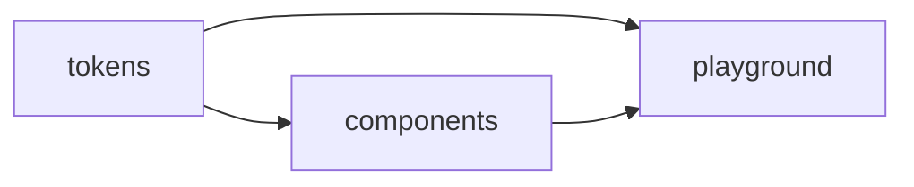

# Arquitectura — agent-design-sistem

Fuente de verdad arquitectónica del repo. Toda decisión significativa vive acá: visión general, principios, organización y ADRs específicos.

## Visión general

`agent-design-sistem` es un monorepo `pnpm` que aloja librerías de **arquitectura frontend** publicables a npm bajo el scope `@romanmartinidev`, junto con una aplicación de prueba (`apps/playground`) que actúa como laboratorio de validación y plataforma de prototipado.

```mermaid
flowchart TB
    subgraph packages
        T[tokens<br/>@romanmartinidev/tokens]
        C[components<br/>@romanmartinidev/components]
    end
    subgraph apps
        P[playground<br/>Angular + Storybook]
    end
    T --> C
    T --> P
    C --> P
```

## Principios arquitectónicos

Las decisiones del repo se evalúan contra estos principios, en estricto orden de prioridad:

1. **Aplicar buenas prácticas.** Si una solución funciona pero contradice una práctica establecida en el ecosistema, no se elige sin justificación explícita.
2. **Escalar ordenado.** La estructura debe sostener crecimiento (más libs, más componentes, más colaboradores) sin reescritura.
3. **Mantenibilidad.** Estándares y convenciones explícitos para que cualquiera (incluido un Claude futuro) pueda entender qué hay, dónde está y por qué.

## Organización del código

```
packages/
├── tokens/         # Design tokens compilados con Style Dictionary
│   ├── src/
│   │   ├── primitives/   # Valores crudos sin semántica de uso
│   │   ├── semantic/     # Tokens con intención (bg-primary, text-muted...)
│   │   ├── component/    # Tokens específicos de un componente
│   │   └── theme/        # Overrides por tema (dark, brand-a, brand-b...)
│   └── dist/             # Salida: CSS + JS + d.ts + themes/
└── components/     # Componentes Angular con ng-packagr
    ├── src/
    │   ├── public-api.ts # Surface pública de la lib
    │   └── lib/          # Implementación interna
    └── (estructura interna definida en ADR-004)

apps/
└── playground/     # Angular app + Storybook
```

## Reglas de dependencia

Visión general (el "por qué"):

- `tokens` no depende de nada del monorepo.
- `components` depende de `tokens` (vía `workspace:*`).
- `playground` depende de `tokens` y `components` (vía `workspace:*`).
- Nunca: dependencia de `tokens` o `components` hacia `playground`.
- Nunca: dependencia circular entre packages.



**Definición testable** (el "qué debe cumplir el sistema"): ver el requirement **"Grafo de dependencias internas es un DAG"** en el spec [`SPC-001 monorepo-structure`](../../openspec/specs/SPC-001-monorepo-structure/spec.md). El requirement formaliza las reglas de arriba en escenarios Given/When/Then verificables.

> Por convención del repo, los principios y diagramas viven en `docs/architecture/`; los contratos testables del sistema viven en `openspec/specs/`. Ver [`CLAUDE.md → Fuentes de verdad`](../../CLAUDE.md).

## ADRs (Architecture Decision Records)

Toda decisión que sea **one-way door** o que afecte **≥2 packages** se documenta como ADR en formato MADR en [adr/](adr/). Los ADRs son **inmutables** una vez aceptados.

Índice rápido en [decisions-log.md](decisions-log.md).

## OpenSpec

Los **cambios significativos** (nueva lib, refactor mayor, cambio de tooling base) se proponen primero en [`openspec/changes/`](../../openspec/changes/) y, si afectan arquitectura, generan un ADR al cerrarse.

Cambios triviales o de implementación local **no** requieren propuesta OpenSpec.

## Material de referencia (no normativo)

[`docs/4.0_arquitectura_frontend/`](../4.0_arquitectura_frontend/) contiene material de investigación traído de otro repo. Sirve como fuente de inspiración y consulta. **No es normativo**: la fuente de verdad son los ADRs de este directorio.
