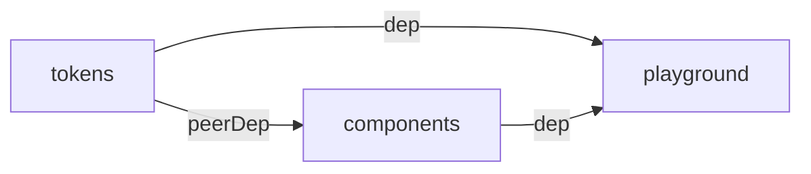

# Arquitectura — design-system

**Fuente única de verdad agregada** de la arquitectura del repo. Sintetiza todas las decisiones tomadas en los ADRs y los contratos definidos en specs. Para detalle de cada decisión con opciones evaluadas, ir a los ADRs linkeados.

> Si querés **replicar esta arquitectura en otro repo desde cero**, ver [PLAYBOOK.md](PLAYBOOK.md).

---

## Tabla de contenidos

1. [Visión general](#visión-general)
2. [Stack tecnológico](#stack-tecnológico)
3. [Principios arquitectónicos](#principios-arquitectónicos)
4. [Estructura del monorepo](#estructura-del-monorepo)
5. [Reglas de dependencia](#reglas-de-dependencia)
6. [Arquitectura de tokens (@romanmartinidev/tokens)](#arquitectura-de-tokens-romanmartinidevtokens)
7. [Arquitectura de components (@romanmartinidev/components)](#arquitectura-de-components-romanmartinidevcomponents)
8. [Arquitectura del playground (apps/playground)](#arquitectura-del-playground-appsplayground)
9. [Convenciones del repo](#convenciones-del-repo)
10. [Pipeline de releases](#pipeline-de-releases)
11. [Catálogo de ADRs](#catálogo-de-adrs)
12. [Catálogo de Specs](#catálogo-de-specs)
13. [Catálogo de Changes](#catálogo-de-changes)

---

## Visión general

`design-system` es un **monorepo `pnpm`** que aloja librerías de **arquitectura frontend** publicables a npm bajo el scope `@romanmartinidev`, junto con una aplicación de prueba (`apps/playground`) que actúa como laboratorio de validación y plataforma de prototipado.

```mermaid
flowchart TB
    subgraph packages [packages — publicables a npm]
        T[tokens<br/>@romanmartinidev/tokens<br/>Style Dictionary 4]
        C[components<br/>@romanmartinidev/components<br/>Angular 21 + ng-packagr]
    end
    subgraph apps [apps — internas]
        P[playground<br/>Angular 21 zoneless<br/>+ Storybook 10]
    end
    T -- workspace:* (peerDep CSS via vars) --> C
    T -- workspace:* (CSS @import) --> P
    C -- workspace:* (TS import) --> P
```

## Stack tecnológico

| Dominio                     | Tecnología                             | Versión                   | ADR/Spec                                                                                             |
| --------------------------- | -------------------------------------- | ------------------------- | ---------------------------------------------------------------------------------------------------- |
| **Package manager**         | pnpm workspaces                        | 9.x                       | [ADR-001](adr/ADR-001-monorepo-pnpm-workspaces.md)                                                   |
| **Runtime**                 | Node                                   | 22 LTS (≥22.12)           | [ADR-001](adr/ADR-001-monorepo-pnpm-workspaces.md)                                                   |
| **Lenguaje**                | TypeScript                             | 5.9                       | —                                                                                                    |
| **Framework UI**            | Angular                                | 21.2                      | [ADR-004](adr/ADR-004-arquitectura-components.md), [ADR-005](adr/ADR-005-arquitectura-playground.md) |
| **Change detection**        | Zoneless                               | Angular 21.2 (estable)    | [ADR-005](adr/ADR-005-arquitectura-playground.md)                                                    |
| **Build tokens**            | Style Dictionary                       | 4.3+                      | [ADR-003](adr/ADR-003-arquitectura-design-tokens.md)                                                 |
| **Build libs Angular**      | ng-packagr (APF)                       | 21.x                      | [ADR-004](adr/ADR-004-arquitectura-components.md)                                                    |
| **Build apps Angular**      | @angular/build (esbuild)               | 21.2                      | —                                                                                                    |
| **Testing**                 | Vitest 4 + @analogjs/vitest-angular    | 4.x + 2.5                 | [ADR-004](adr/ADR-004-arquitectura-components.md)                                                    |
| **Visualización**           | Storybook 10                           | 10.4 + @storybook/angular | [ADR-005](adr/ADR-005-arquitectura-playground.md)                                                    |
| **Versionado de packages**  | Changesets                             | 2.x                       | [ADR-002](adr/ADR-002-conventional-commits-changesets.md)                                            |
| **Convenciones de commits** | Conventional Commits + commitlint      | 21.x                      | [ADR-002](adr/ADR-002-conventional-commits-changesets.md)                                            |
| **Pre-commit hooks**        | Husky + lint-staged                    | 9.x + 17.x                | [ADR-002](adr/ADR-002-conventional-commits-changesets.md)                                            |
| **Lint**                    | ESLint flat config + typescript-eslint | 10.x + 8.x                | [ADR-001](adr/ADR-001-monorepo-pnpm-workspaces.md)                                                   |
| **Format**                  | Prettier                               | 3.x                       | —                                                                                                    |
| **Specs y gobernanza**      | OpenSpec (`@fission-ai/openspec`)      | 1.6.0 (pin exacto)        | —                                                                                                    |
| **ADRs**                    | MADR                                   | —                         | [adr/README.md](adr/README.md)                                                                       |

## Principios arquitectónicos

Las decisiones del repo se evalúan contra estos principios, en estricto orden de prioridad:

1. **Aplicar buenas prácticas.** Si una solución funciona pero contradice una práctica establecida en el ecosistema, no se elige sin justificación explícita.
2. **Escalar ordenado.** La estructura debe sostener crecimiento (más libs, más componentes, más colaboradores) sin reescritura.
3. **Mantenibilidad.** Estándares y convenciones explícitos para que cualquier dev (o IA) pueda entender qué hay, dónde está y por qué.

## Estructura del monorepo

```
design-system/
├── packages/                  # Librerías publicables (npm)
│   ├── tokens/                # @romanmartinidev/tokens
│   └── components/            # @romanmartinidev/components
├── apps/
│   └── playground/            # App Angular interna (no publicable)
├── docs/
│   ├── architecture/          # Fuente de verdad arquitectónica
│   │   ├── README.md          # Este archivo
│   │   ├── PLAYBOOK.md        # Cómo replicar la arq en otro repo
│   │   ├── adr/               # ADRs en formato MADR
│   │   └── decisions-log.md   # Índice cronológico de ADRs
│   ├── product/               # Épicas (EP-XXX), HUs (HU-XXX), decisiones D-XXX, intake de ideas
│   ├── backlog/               # BACKLOG.md (Now/Next/Later) + reportes de fix del PO
│   ├── design/                # Evidencia fechada: auditorías a11y + research de sistemas externos
│   ├── reviews/               # Reviews integrales del repo (hallazgos + plan de acción)
│   └── reference/             # Material de investigación (no normativo)
├── openspec/
│   ├── README.md              # Convención de IDs + próximo ID disponible (operativo, no arquitectónico)
│   ├── specs/                 # Contratos testables (sin IDs — identificados por nombre)
│   └── changes/               # Propuestas de cambio (activos sin prefijo, archivados con aaa-NNN-)
├── scripts/                   # Utilidades de repo (new-github-repo.ps1)
├── .github/                   # workflows/ (pr.yml, release.yml) + actions/setup/ (composite)
├── .changeset/                # Cambios pendientes de release
├── .husky/                    # pre-commit + commit-msg hooks
├── package.json               # Root del monorepo
├── pnpm-workspace.yaml
├── .nvmrc, .npmrc, .editorconfig, .gitignore, .prettierrc, .prettierignore
├── eslint.config.js
├── commitlint.config.js
├── lint-staged.config.js
├── CLAUDE.md                  # Contrato Claude ↔ repo
├── CONTRIBUTING.md            # Flujo de trabajo
├── README.md
└── LICENSE
```

## Reglas de dependencia

- `tokens` no depende de nada del monorepo.
- `components` depende de `tokens` como **peerDependency** (`workspace:*`).
- `playground` depende de `tokens` y `components` como **dependencies** (`workspace:*`).
- Nunca: dependencia de `tokens` o `components` hacia `playground`.
- Nunca: dependencia circular entre packages.



**Contrato testable**: requirement _"Grafo de dependencias internas es un DAG"_ en [monorepo-structure](../../openspec/specs/monorepo-structure/spec.md).

## Arquitectura de tokens (`@romanmartinidev/tokens`)

**Decisión formal**: [ADR-003 — Arquitectura de design tokens](adr/ADR-003-arquitectura-design-tokens.md).
**Contrato testable**: [design-tokens-package](../../openspec/specs/design-tokens-package/spec.md).

### Jerarquía (primitives → semantic → component → theme)

```
packages/tokens/src/
├── primitives/    # Valores crudos sin semántica (color.blue.500, dimension.16, shadow.md)
├── semantic/      # Tokens con intención (bg.primary, text.muted, border.default, space.md, shadow.focus)
├── component/     # Tokens específicos por componente (button.bg, modal.shadow)
└── theme/         # Overrides de tokens semantic (dark, brand-a, brand-b)
```

**Reglas de referencia**:

- `semantic` referencia `primitives` (no al revés).
- `component` referencia `semantic` o `primitives` (no `theme`).
- `theme` **solo redefine** tokens existentes en `semantic` (no introduce nuevos).
- Sin referencias circulares.

### Build con Style Dictionary 4

```bash
pnpm -F @romanmartinidev/tokens build
```

Output:

- `dist/tokens.css` — variables CSS en `:root`
- `dist/tokens.js` + `dist/tokens.d.ts` — constantes JS/TS
- `dist/themes/<theme>.css` — un CSS por theme bajo selector `[data-theme="..."]` o `[data-brand="..."]`

### Prefix CSS: `--ds-*`

**Parte del contrato API público**. Cambiarlo es BREAKING y exige ADR que reemplace al ADR-003.

```css
:root {
  --ds-color-blue-500: #3b82f6;
  --ds-semantic-color-bg-primary: var(--ds-color-blue-500);
}
```

### Theming por cascada CSS + atributos HTML

```html
<html data-theme="dark" data-brand="a">
  <!-- toda la cascada usa dark + brand-a, combinables -->
</html>
```

Cada theme se importa opt-in:

```ts
import '@romanmartinidev/tokens/css';
import '@romanmartinidev/tokens/themes/dark';
```

### Surface de exports granular

```jsonc
{
  ".": { "import": "./dist/tokens.js", "types": "./dist/tokens.d.ts" },
  "./css": "./dist/tokens.css",
  "./themes/dark": "./dist/themes/dark.css",
  "./themes/brand-a": "./dist/themes/brand-a.css",
  "./themes/brand-b": "./dist/themes/brand-b.css",
}
```

`sideEffects: ["./dist/*.css", "./dist/themes/*.css"]` permite tree-shaking del JS preservando CSS.

### Jerarquía de z-index

Los tokens `semantic.z-index` (declarados en [`packages/tokens/src/semantic/z-index.json`](../../packages/tokens/src/semantic/z-index.json)) definen 13 niveles que cubren todos los casos de layering visual de una UI moderna. Escala en miles para overlays, estilo Bootstrap, con margen para intercalar capas nuevas sin colisión.

| Token              | Valor    | Uso típico                                              |
| ------------------ | -------- | ------------------------------------------------------- |
| `z-index.hide`     | `-1`     | Elemento oculto detrás del flujo normal                 |
| `z-index.auto`     | `"auto"` | Resetear stacking context al default del browser        |
| `z-index.base`     | `0`      | Capa base del documento                                 |
| `z-index.docked`   | `10`     | Elementos anclados al viewport (header, sidebar)        |
| `z-index.dropdown` | `1000`   | Dropdowns de menús de navegación                        |
| `z-index.sticky`   | `1020`   | Elementos sticky (table headers, sticky footers)        |
| `z-index.banner`   | `1030`   | Banners de notificación (cookie consent, announcements) |
| `z-index.overlay`  | `1040`   | Backdrops/scrims de modales y drawers                   |
| `z-index.modal`    | `1050`   | Modales y diálogos                                      |
| `z-index.popover`  | `1060`   | Popovers contextuales (sobre modales si conviven)       |
| `z-index.skiplink` | `1070`   | Skip-to-content links (a11y, encima de modales)         |
| `z-index.toast`    | `1080`   | Toast notifications                                     |
| `z-index.tooltip`  | `1090`   | Tooltips (capa más alta, deben verse siempre)           |

**Convención obligatoria**: NO hardcodear `z-index` en CSS de componentes. Siempre via `var(--ds-semantic-z-index-<level>)`. El [spec `design-tokens-package`](../../openspec/specs/design-tokens-package/spec.md) formaliza este contrato con scenarios testables (test Vitest en `packages/tokens/test/z-index.spec.ts` valida la jerarquía).

### Tokens auxiliares para overlays

Para componentes con backdrop semitransparente (Modal, Drawer, Toast con scrim), el sistema expone:

- `var(--ds-semantic-color-bg-overlay)` — rgba negro 0.5 alpha (scrim).
- `var(--ds-semantic-effect-blur-overlay)` — 8px (backdrop-filter blur estándar).
- `var(--ds-semantic-motion-transition-overlay-enter)` — 250ms ease-out (entrada compuesta duration + easing).
- `var(--ds-semantic-motion-transition-overlay-exit)` — 150ms ease-in (salida compuesta, ~60% más rápida que la entrada por convención UX).

## Arquitectura de components (`@romanmartinidev/components`)

**Decisión formal**: [ADR-004 — Arquitectura de @romanmartinidev/components](adr/ADR-004-arquitectura-components.md).
**Contrato testable transversal**: [components-package](../../openspec/specs/components-package/spec.md); el comportamiento de cada componente vive en su [`component-<name>`](#specs-por-componente-component-name) (ADR-018).

### Build con ng-packagr (Angular Package Format)

```bash
pnpm -F @romanmartinidev/components build
```

Sin `angular.json` propio. ng-packagr corre standalone con `ng-package.json`. Produce `dist/fesm2022/*.mjs` + `dist/types/*.d.ts` + `dist/package.json`.

### Estructura interna: flat por componente

```
packages/components/src/
├── public-api.ts          # Barrel — surface pública
└── lib/
    └── <name>/            # Una carpeta por componente
        ├── <name>.ts
        ├── <name>.css
        ├── <name>.spec.ts
        ├── <name>.stories.ts   # Co-ubicada (Storybook desde apps/playground)
        └── index.ts            # Re-export interno
```

### Standalone + signals + new APIs

```ts
@Component({
  selector: 'ds-button',
  standalone: true,
  changeDetection: ChangeDetectionStrategy.OnPush,
  template: `<button [disabled]="disabled()" (click)="handleClick($event)"><ng-content /></button>`,
  styleUrl: './button.css',
})
export class DsButton {
  variant = input<'primary' | 'secondary' | 'ghost'>('primary');
  disabled = input<boolean>(false);
  clicked = output<MouseEvent>();
}
```

- `input()` / `output()` / `model()` signals (no `@Input()` / `@Output()`).
- Sin `NgModule`s.

### Prefijo unificado `Ds` / `ds-`

**Parte del contrato API público**. Coexiste con `--ds-*` (CSS variables) bajo el mismo prefijo conceptual `Ds` (Design System).

Decisión formal: [ADR-007 — Convención de naming y prefijos](adr/ADR-007-naming-prefijos.md). Supersede parcialmente §4 y §5 de ADR-004.

### Naming convention

| Pieza    | Convención                          | Ejemplo           |
| -------- | ----------------------------------- | ----------------- |
| Carpeta  | kebab-case                          | `button/`         |
| Archivo  | `<name>.ts` (sin sufijo de rol)     | `button.ts`       |
| Class    | `Ds<Name>` (sin sufijo `Component`) | `DsButton`        |
| Selector | `ds-<name>`                         | `ds-button`       |
| Types    | `Ds<Name><TypeName>`                | `DsButtonVariant` |

### Styles: CSS plain + tokens via vars

Archivos `.css` (no SCSS). Consumo exclusivo de tokens via `var(--ds-*)`. Sin valores hardcoded.

### peerDependencies

- `@angular/core@^21`, `@angular/common@^21`
- `@romanmartinidev/tokens: workspace:*` (Changesets lo reescribe a versión semver al publicar)

### Surface

`exports` en root `package.json` apunta a `dist/fesm2022/...` y `dist/types/...` (ng-packagr genera el `dist/package.json` con `exports` propios al buildear).

## Arquitectura del playground (`apps/playground`)

**Decisión formal**: [ADR-005 — Arquitectura del playground](adr/ADR-005-arquitectura-playground.md).
**Contrato testable**: [playground-app](../../openspec/specs/playground-app/spec.md).

### Rol

Laboratorio interno. **No se publica** (`"private": true`). Sirve como:

- Validador end-to-end del consumo de las libs en una app Angular real.
- Host de **Storybook 10** con stories co-ubicadas en `packages/components/`.

### Zoneless

```ts
// apps/playground/src/app/app.config.ts
import { provideZonelessChangeDetection } from '@angular/core';

export const appConfig: ApplicationConfig = {
  providers: [
    provideBrowserGlobalErrorListeners(),
    provideZonelessChangeDetection(),
    provideRouter(routes),
  ],
};
```

Sin `zone.js` en deps ni polyfills. Bundle más chico, change detection puramente reactivo via signals.

### Storybook co-ubicado

- Config en `apps/playground/.storybook/`.
- `main.ts` glob recoge stories desde `packages/components/src/lib/**/*.stories.@(ts|mdx)`.
- Targets `storybook` y `build-storybook` en `angular.json` con builder `@storybook/angular`.
- Tokens CSS inyectados vía `styles: ["src/styles.css"]` del target (no via `preview.ts`).

### Showcase con router (aaa-022), sin SSR

Desde [aaa-022](../../openspec/changes/archive/aaa-022-playground-showcase/) el playground es un **showcase navegable**, no una single page de demos:

- `provideRouter(routes)` en `app.config.ts` y `<router-outlet />` en `app.html`.
- Las rutas **se generan desde un registro único** (`src/app/showcase/registry.ts`, hoy 24 entradas): una ruta **lazy** por componente vía `loadComponent`, más `''` y `**` redirigiendo a la primera entrada. Agregar un componente al showcase es agregar una entrada al registro — no se tocan las rutas a mano.
- Cada vista vive en `src/app/showcase/<slug>/` y lleva `data: { breadcrumb }`, que alimenta la demo de auto-generación de `ds-breadcrumbs-router` (ADR-017).
- **Sin SSR**: el playground se sirve solo en browser (ver el estado de compatibilidad SSR de la lib en su change correspondiente).

## Convenciones del repo

### Conventional Commits + commitlint

```
<type>(<scope>): <subject>
```

Tipos: `feat`, `fix`, `chore`, `docs`, `style`, `refactor`, `perf`, `test`, `build`, `ci`, `revert`.
Scopes habituales: `tokens`, `components`, `playground`, `repo`, `ci`, `docs`, `deps`.

Validado en el hook `commit-msg` por commitlint con `@commitlint/config-conventional`.

### Pre-commit con Husky + lint-staged

`pre-commit`: `lint-staged` corre `eslint --fix` + `prettier --write` sobre archivos staged.
`commit-msg`: commitlint valida el formato.

### Versionado con Changesets

- Cada PR que afecta una lib publicable agrega un changeset (`pnpm changeset`).
- Al release: `changeset version` (actualiza versiones + CHANGELOG) + `changeset publish`, **ambos ejecutados por `release.yml` vía `changesets/action`, nunca a mano**. El script del root se llama `changeset:version` y no `version`, porque el builtin `pnpm version` pisaría al homónimo; no existe script `release` (eliminado para que no haya publish manual de un comando).
- **Lockstep** ([ADR-015](adr/ADR-015-versionado-lockstep.md)): `tokens` y `components` versionan juntos (`fixed` de Changesets, versión única del par). El bump que se elige en el changeset aplica al par, no a un package suelto. El peer de tokens es un rango plano pre-1.0 (`>=0.1.0 <1.0.0`) con `onlyUpdatePeerDependentsWhenOutOfRange`, para evitar la cascada peer→major.
- `workspace:*` se reescribe a semver real al publicar.
- Pre-1.0: política permisiva; al primer release se decide la política definitiva.
- **Veto de publicación vigente** ([D-018](../product/decisiones.md)): los changesets se acumulan a propósito y nada se publica hasta orden explícita del PO.

### ADRs (formato MADR)

- Toda decisión one-way door o que afecta ≥2 packages genera un ADR en [adr/](adr/).
- Naming: `ADR-NNN-<slug-kebab-case>.md`.
- **Inmutables** una vez aceptados. Para revertir, crear ADR nuevo que referencia al anterior.
- Índice: [decisions-log.md](decisions-log.md).
- Formato detallado: [adr/README.md](adr/README.md).

### Specs y changes con OpenSpec

- Cambios significativos (nueva lib, refactor mayor) arrancan como propuesta en `openspec/changes/<name>/` (sin prefijo de ID).
- Estructura del change: `proposal.md` + `design.md` + `tasks.md` + `specs/<capability>/spec.md`.
- Al cerrar un change, el directorio se renombra a `<id>-<name>` y se mueve a `openspec/changes/archive/`. Los deltas de spec se promueven a la spec base `openspec/specs/<capability>/spec.md`.
- Validación: `openspec validate --all`.

### IDs persistentes (formato `<bloque>-<numero>`, ver [ADR-008](adr/ADR-008-convencion-ids-openspec.md))

- **Changes**: ID `aaa-NNN` (`aaa-001`, `aaa-002`, …). Cuando `aaa-999` se llena, sigue `aab-001`, después `aac-001`, etc. El ID vive en el frontmatter `proposal.md`.
- **Specs**: **sin IDs**. Se identifican por el nombre de su carpeta (`openspec/specs/<name>/`).
- **ADRs**: `ADR-NNN` numéricos (rango único). Inmutables una vez aceptados.
- Convención operativa + próximo ID disponible: [openspec/README.md](../../openspec/README.md).

### Lint + format

- ESLint flat config (`eslint.config.js`) compartido en root.
- `typescript-eslint` con presets recomendados.
- Prettier 3 — config en `.prettierrc`.
- `.prettierignore` excluye scaffolds importados (`.claude/`), material de referencia, dist/, etc.

### Stack pinning

- `.nvmrc` → versión exacta de Node.
- `.npmrc` → `engine-strict=true`, `auto-install-peers=true`, `strict-peer-dependencies=true`, `prefer-workspace-packages=true`.
- `pnpm.overrides.esbuild` en root para evitar mismatch entre vitest y @angular/build.
- `packageManager: "pnpm@..."` en root para corepack.

## Pipeline de releases

**Decisión formal**: [ADR-006 — Estrategia de CI/CD](adr/ADR-006-estrategia-ci-cd.md).
**Contrato testable**: [ci-cd-pipeline](../../openspec/specs/ci-cd-pipeline/spec.md).

Dos workflows GitHub Actions:

- **`pr.yml`** (trigger: `pull_request` a `main`) — corre `actionlint` + `commitlint` + `format:check` + `lint` + `pnpm -r build` + `pnpm -r test` + `verify:packaging` + `openspec validate --all` + changeset enforcement (PRs que tocan `packages/*` requieren changeset, excepto README/CHANGELOG y el PR autogenerado `changeset-release/main`).
- **`release.yml`** (trigger: `push` a `main`) — usa [`changesets/action`](https://github.com/changesets/action) en **dos jobs**: `version` abre o actualiza el PR `chore(repo): version packages` si hay changesets pendientes; `publish` corre build + `changeset publish` si no quedan (post-merge del PR de release), **detrás del environment `npm-publish` con required reviewer** ([ADR-022](adr/ADR-022-gate-aprobacion-publish-npm.md)).

**Supply chain**: todas las actions externas están pineadas por SHA completo con el tag como comentario, y `.github/dependabot.yml` (npm + github-actions, weekly) trae los bumps como PRs revisables.

**Composite action** `.github/actions/setup/` extrae setup pnpm + node (`node-version-file: '.nvmrc'`) + cache + install. Reutilizada en ambos workflows.

**Branch protection** documentada como checklist en [`CONTRIBUTING.md § Branch protection`](../../CONTRIBUTING.md#branch-protection-acci%C3%B3n-del-mantenedor) — se configura manualmente en GitHub UI.

**Out of scope** (follow-ups documentados en ADR-006): Storybook deploy, a11y CI con axe, bundle budget con size-limit, visual regression (Chromatic/Playwright), Sigstore provenance, validación de título del PR.

## Catálogo de ADRs

| ID                                                               | Título                                                                    | Dominio               | Estado                                    |
| ---------------------------------------------------------------- | ------------------------------------------------------------------------- | --------------------- | ----------------------------------------- |
| [ADR-001](adr/ADR-001-monorepo-pnpm-workspaces.md)               | Adoptar pnpm workspaces                                                   | transversal           | Aceptado                                  |
| [ADR-002](adr/ADR-002-conventional-commits-changesets.md)        | Conventional Commits + Changesets                                         | transversal           | Aceptado                                  |
| [ADR-003](adr/ADR-003-arquitectura-design-tokens.md)             | Arquitectura de design tokens                                             | frontend/tokens       | Aceptado                                  |
| [ADR-004](adr/ADR-004-arquitectura-components.md)                | Arquitectura de components                                                | frontend/components   | Aceptado                                  |
| [ADR-005](adr/ADR-005-arquitectura-playground.md)                | Arquitectura del playground                                               | frontend/playground   | Aceptado                                  |
| [ADR-006](adr/ADR-006-estrategia-ci-cd.md)                       | Estrategia de CI/CD                                                       | transversal/ci        | Aceptado                                  |
| [ADR-007](adr/ADR-007-naming-prefijos.md)                        | Convención de naming y prefijos `Ds`/`ds-`/`--ds-*`                       | frontend/components   | Aceptado                                  |
| [ADR-008](adr/ADR-008-convencion-ids-openspec.md)                | Convención de IDs de OpenSpec (aaa-NNN, specs sin ID)                     | transversal/openspec  | Aceptado                                  |
| [ADR-009](adr/ADR-009-figma-tokens-export.md)                    | Export de tokens a Figma (DTCG vía Tokens Studio)                         | frontend/tokens       | **Propuesto** (change `aaa-012` en pausa) |
| [ADR-010](adr/ADR-010-file-naming-sin-sufijo-component.md)       | File naming sin sufijo de rol (`button.ts`)                               | frontend/components   | Aceptado                                  |
| [ADR-011](adr/ADR-011-estado-disabled-accesible.md)              | Estado disabled accesible (`aria-disabled` + guarda vs `disabled` nativo) | frontend/components   | Aceptado                                  |
| [ADR-012](adr/ADR-012-iconografia-lucide.md)                     | Iconografía vía `@lucide/angular`                                         | frontend/components   | Aceptado                                  |
| [ADR-013](adr/ADR-013-overlays-dialog-nativo.md)                 | Overlays modales sobre `<dialog>` nativo                                  | frontend/components   | Aceptado                                  |
| [ADR-014](adr/ADR-014-overlays-anclados-popover-api.md)          | Overlays anclados sobre Popover API                                       | frontend/components   | Aceptado                                  |
| [ADR-015](adr/ADR-015-versionado-lockstep.md)                    | Versionado lockstep de tokens + components                                | transversal/release   | Aceptado                                  |
| [ADR-016](adr/ADR-016-posicionamiento-placements-por-overlay.md) | Placements por tipo de overlay (flip + clamp propios)                     | frontend/components   | Aceptado                                  |
| [ADR-017](adr/ADR-017-secondary-entry-points.md)                 | Secondary entry points APF con peer opcional                              | transversal/packaging | Aceptado                                  |
| [ADR-018](adr/ADR-018-specs-por-componente.md)                   | Specs por componente (`component-<name>`) + regla de partición            | transversal/openspec  | Aceptado                                  |
| [ADR-019](adr/ADR-019-modelo-variantes-tono-apariencia.md)       | Modelo de variantes: `tone × appearance` vs `variant` plano               | frontend/components   | Aceptado                                  |
| [ADR-020](adr/ADR-020-base-compartida-form-fields.md)            | Base compartida `DsFieldBase` para form fields                            | frontend/components   | Aceptado                                  |
| [ADR-021](adr/ADR-021-estrategia-publicacion-packages.md)        | Publicación por tipo de package: dist para components, root para tokens   | transversal/packaging | Aceptado (matiza ADR-017 regla 4)         |
| [ADR-022](adr/ADR-022-gate-aprobacion-publish-npm.md)            | Gate de aprobación del publish a npm: environment con required reviewer   | ci/seguridad          | Aceptado (matiza ADR-006)                 |

Ver índice completo con el fundamento de cada decisión (incluidas las que no generaron ADR): [decisions-log.md](decisions-log.md).

## Catálogo de Specs

Las specs ya no usan IDs — se identifican por el nombre de su carpeta.

| Spec                                                                        | Capability                                                                                                                                 | Path                                    |
| --------------------------------------------------------------------------- | ------------------------------------------------------------------------------------------------------------------------------------------ | --------------------------------------- |
| [monorepo-structure](../../openspec/specs/monorepo-structure/spec.md)       | Reglas del monorepo (pnpm, workspaces, DAG, hooks)                                                                                         | `openspec/specs/monorepo-structure/`    |
| [design-tokens-package](../../openspec/specs/design-tokens-package/spec.md) | Contrato del package tokens                                                                                                                | `openspec/specs/design-tokens-package/` |
| [components-package](../../openspec/specs/components-package/spec.md)       | Contrato **transversal** del package components (identidad, peer deps, build APF, naming, disabled accesible ADR-011, iconografía ADR-012) | `openspec/specs/components-package/`    |
| [playground-app](../../openspec/specs/playground-app/spec.md)               | Contrato de la app playground                                                                                                              | `openspec/specs/playground-app/`        |
| [ci-cd-pipeline](../../openspec/specs/ci-cd-pipeline/spec.md)               | Pipeline de CI/CD y release                                                                                                                | `openspec/specs/ci-cd-pipeline/`        |

### Specs por componente (`component-<name>`)

Una capability por componente del kit (ADR-018, aaa-030): cada una con el contrato de comportamiento de su componente. Un change de componente futuro escribe su delta contra la spec de acá; `components-package` solo se toca para lo transversal.

| Spec                                                                        | Componente(s)                          |
| --------------------------------------------------------------------------- | -------------------------------------- |
| [component-avatar](../../openspec/specs/component-avatar/spec.md)           | `DsAvatar` + `DsAvatarGroup`           |
| [component-badge](../../openspec/specs/component-badge/spec.md)             | `DsBadge` (tone × appearance)          |
| [component-button](../../openspec/specs/component-button/spec.md)           | `DsButton` (loading, variantes, tests) |
| [component-card](../../openspec/specs/component-card/spec.md)               | Familia `DsCard`                       |
| [component-checkbox](../../openspec/specs/component-checkbox/spec.md)       | `DsCheckbox`                           |
| [component-radio](../../openspec/specs/component-radio/spec.md)             | `DsRadioGroup` + `DsRadio`             |
| [component-select](../../openspec/specs/component-select/spec.md)           | `DsSelect` + `DsOption`                |
| [component-input](../../openspec/specs/component-input/spec.md)             | `DsInput`                              |
| [component-textarea](../../openspec/specs/component-textarea/spec.md)       | `DsTextarea` (field multilínea)        |
| [component-modal](../../openspec/specs/component-modal/spec.md)             | `DsModal`                              |
| [component-tabs](../../openspec/specs/component-tabs/spec.md)               | `DsTabs` + `DsTab`                     |
| [component-tooltip](../../openspec/specs/component-tooltip/spec.md)         | `DsTooltip` (directiva)                |
| [component-toast](../../openspec/specs/component-toast/spec.md)             | `DsToastService`                       |
| [component-spinner](../../openspec/specs/component-spinner/spec.md)         | `DsSpinner`                            |
| [component-switch](../../openspec/specs/component-switch/spec.md)           | `DsSwitch` (toggle, CVA)               |
| [component-skeleton](../../openspec/specs/component-skeleton/spec.md)       | `DsSkeleton`                           |
| [component-menu](../../openspec/specs/component-menu/spec.md)               | `DsMenu` (familia)                     |
| [component-accordion](../../openspec/specs/component-accordion/spec.md)     | `DsAccordion`                          |
| [component-breadcrumbs](../../openspec/specs/component-breadcrumbs/spec.md) | `DsBreadcrumbs`                        |
| [component-pagination](../../openspec/specs/component-pagination/spec.md)   | `DsPagination`                         |
| [component-progress](../../openspec/specs/component-progress/spec.md)       | `DsProgress`                           |

## Catálogo de Changes

| ID                                                                                  | Change                           | Estado   | Fecha      | Specs introducidas / modificadas                                                                                                                                                                         | ADRs generados                                                                                           |
| ----------------------------------------------------------------------------------- | -------------------------------- | -------- | ---------- | -------------------------------------------------------------------------------------------------------------------------------------------------------------------------------------------------------- | -------------------------------------------------------------------------------------------------------- |
| [aaa-001](../../openspec/changes/archive/aaa-001-bootstrap-fase-1-monorepo/)        | bootstrap-fase-1-monorepo        | archived | 2026-05-30 | monorepo-structure                                                                                                                                                                                       | ADR-001, ADR-002                                                                                         |
| [aaa-002](../../openspec/changes/archive/aaa-002-bootstrap-fase-2-tokens/)          | bootstrap-fase-2-tokens          | archived | 2026-05-31 | design-tokens-package                                                                                                                                                                                    | ADR-003                                                                                                  |
| [aaa-003](../../openspec/changes/archive/aaa-003-bootstrap-fase-3-components/)      | bootstrap-fase-3-components      | archived | 2026-05-31 | components-package                                                                                                                                                                                       | ADR-004                                                                                                  |
| [aaa-004](../../openspec/changes/archive/aaa-004-bootstrap-fase-4-playground/)      | bootstrap-fase-4-playground      | archived | 2026-06-01 | playground-app                                                                                                                                                                                           | ADR-005                                                                                                  |
| [aaa-005](../../openspec/changes/archive/aaa-005-bootstrap-fase-5-ci/)              | bootstrap-fase-5-ci              | archived | 2026-06-01 | ci-cd-pipeline                                                                                                                                                                                           | ADR-006                                                                                                  |
| [aaa-006](../../openspec/changes/archive/aaa-006-components-add-checkbox/)          | components-add-checkbox          | archived | 2026-06-01 | modifica components-package                                                                                                                                                                              | —                                                                                                        |
| [aaa-007](../../openspec/changes/archive/aaa-007-components-unify-ds-prefix/)       | components-unify-ds-prefix       | archived | 2026-06-04 | modifica components-package                                                                                                                                                                              | ADR-007 (supersede ADR-004 §4+§5)                                                                        |
| [aaa-008](../../openspec/changes/archive/aaa-008-components-add-radio/)             | components-add-radio             | archived | 2026-06-08 | modifica components-package                                                                                                                                                                              | —                                                                                                        |
| [aaa-009](../../openspec/changes/archive/aaa-009-tokens-add-z-index/)               | tokens-add-z-index               | archived | 2026-06-08 | modifica design-tokens-package                                                                                                                                                                           | —                                                                                                        |
| [aaa-010](../../openspec/changes/archive/aaa-010-components-drop-component-suffix/) | components-drop-component-suffix | archived | 2026-07-03 | modifica components-package + playground-app                                                                                                                                                             | ADR-010 (evoluciona ADR-007 file naming)                                                                 |
| [aaa-011](../../openspec/changes/archive/aaa-011-components-accessible-disabled/)   | components-accessible-disabled   | archived | 2026-07-03 | modifica components-package                                                                                                                                                                              | ADR-011 (disabled accesible)                                                                             |
| [aaa-013](../../openspec/changes/archive/aaa-013-components-decide-icon-library/)   | components-decide-icon-library   | archived | 2026-07-03 | modifica components-package                                                                                                                                                                              | ADR-012 (iconografía Lucide)                                                                             |
| [aaa-014](../../openspec/changes/archive/aaa-014-components-add-modal/)             | components-add-modal             | archived | 2026-07-10 | modifica components-package + design-tokens-package                                                                                                                                                      | ADR-013 (overlays sobre dialog nativo)                                                                   |
| [aaa-015](../../openspec/changes/archive/aaa-015-tokens-fix-contrast-aa/)           | tokens-fix-contrast-aa           | archived | 2026-07-11 | modifica design-tokens-package                                                                                                                                                                           | — (ejecuta D-007/D-008)                                                                                  |
| [aaa-016](../../openspec/changes/archive/aaa-016-components-add-select/)            | components-add-select            | archived | 2026-07-11 | modifica components-package                                                                                                                                                                              | ADR-014 (overlays anclados Popover API)                                                                  |
| [aaa-017](../../openspec/changes/archive/aaa-017-components-add-input/)             | components-add-input             | archived | 2026-07-11 | modifica components-package + design-tokens-package                                                                                                                                                      | — (aplica ADR-011/012/014)                                                                               |
| [aaa-018](../../openspec/changes/archive/aaa-018-components-add-tabs/)              | components-add-tabs              | archived | 2026-07-14 | modifica components-package + design-tokens-package                                                                                                                                                      | — (aplica ADR-011 y patrones del kit)                                                                    |
| [aaa-019](../../openspec/changes/archive/aaa-019-components-add-tooltip/)           | components-add-tooltip           | archived | 2026-07-18 | modifica components-package + design-tokens-package                                                                                                                                                      | — (primer reuso de ADR-014)                                                                              |
| [aaa-020](../../openspec/changes/archive/aaa-020-repo-release-lockstep/)            | repo-release-lockstep            | archived | 2026-07-18 | modifica components-package                                                                                                                                                                              | ADR-015 (versionado lockstep)                                                                            |
| [aaa-021](../../openspec/changes/archive/aaa-021-components-add-toast/)             | components-add-toast             | archived | 2026-07-18 | modifica components-package + design-tokens-package                                                                                                                                                      | — (primera service del kit)                                                                              |
| [aaa-022](../../openspec/changes/archive/aaa-022-playground-showcase/)              | playground-showcase              | archived | 2026-07-19 | modifica playground-app                                                                                                                                                                                  | — (showcase con router, EP-006)                                                                          |
| [aaa-023](../../openspec/changes/archive/aaa-023-components-add-spinner/)           | components-add-spinner           | archived | 2026-07-19 | modifica components-package + design-tokens-package                                                                                                                                                      | — (reduced-motion por reemplazo; ADR si Skeleton lo repite)                                              |
| [aaa-024](../../openspec/changes/archive/aaa-024-components-add-skeleton/)          | components-add-skeleton          | archived | 2026-07-19 | modifica components-package + design-tokens-package                                                                                                                                                      | — (reduced-motion apaga: no repite el patrón, sin ADR; cierra tanda 1 D-009)                             |
| [aaa-025](../../openspec/changes/archive/aaa-025-components-add-menu/)              | components-add-menu              | archived | 2026-07-19 | modifica components-package + design-tokens-package                                                                                                                                                      | ADR-016 (placements por overlay; submenús v1 por D-011, contraste D-012)                                 |
| [aaa-026](../../openspec/changes/archive/aaa-026-components-add-accordion/)         | components-add-accordion         | archived | 2026-07-20 | modifica components-package + design-tokens-package                                                                                                                                                      | — (anidados v1 por D-011; grid 0fr→1fr sin ADR hasta 2º colapsable, D-005)                               |
| [aaa-027](../../openspec/changes/archive/aaa-027-components-add-breadcrumbs/)       | components-add-breadcrumbs       | archived | 2026-07-20 | modifica components-package + design-tokens-package                                                                                                                                                      | ADR-017 (secondary entry points; primer entry point `router` peer opcional)                              |
| [aaa-028](../../openspec/changes/archive/aaa-028-components-add-pagination/)        | components-add-pagination        | archived | 2026-07-20 | modifica components-package + design-tokens-package                                                                                                                                                      | — (ventana pageWindow como función pura; reutiliza ADR-011/012, sin ADR)                                 |
| [aaa-029](../../openspec/changes/archive/aaa-029-components-add-progress/)          | components-add-progress          | archived | 2026-07-20 | modifica components-package + design-tokens-package                                                                                                                                                      | — (fills vía text.\*; primer gate UI 3:1; completa la tanda 2 D-011)                                     |
| [aaa-030](../../openspec/changes/archive/aaa-030-specs-split-por-componente/)       | specs-split-por-componente       | archived | 2026-07-20 | modifica components-package (−19 reqs) + introduce 16 `component-<name>`                                                                                                                                 | ADR-018 (specs por componente; regla de partición transversal vs específico)                             |
| [aaa-031](../../openspec/changes/archive/aaa-031-components-button-loading/)        | components-button-loading        | archived | 2026-07-22 | modifica component-button (ADDED estado loading)                                                                                                                                                         | — (D-013 refinamiento visual del botón; sin ADR: `loading` solo en `DsButton`)                           |
| [aaa-032](../../openspec/changes/archive/aaa-032-components-add-card/)              | components-add-card              | archived | 2026-07-22 | introduce component-card (familia DsCard; tokens del bootstrap + 3 aditivos)                                                                                                                             | — (D-014 tanda 3, primera entrega; selector híbrido local a la familia)                                  |
| [aaa-033](../../openspec/changes/archive/aaa-033-components-button-variants/)       | components-button-variants       | archived | 2026-07-22 | modifica component-button (ADDED variantes) + tokens danger (D-016)                                                                                                                                      | — (D-014 tanda 3; D-016 corrige la cadena danger AA en la fuente)                                        |
| [aaa-034](../../openspec/changes/archive/aaa-034-components-add-badge/)             | components-add-badge             | archived | 2026-07-22 | introduce component-badge (DsBadge tone × appearance) + tokens badge/neutral                                                                                                                             | ADR-019 (modelo tone × appearance; estrenado por Badge) · D-017                                          |
| [aaa-035](../../openspec/changes/archive/aaa-035-components-add-switch/)            | components-add-switch            | archived | 2026-07-23 | introduce component-switch (DsSwitch CVA) + tokens switch (lg, bg-off themable)                                                                                                                          | — (D-014 tanda 3; reutiliza ADR-011 disabled nativo)                                                     |
| [aaa-036](../../openspec/changes/archive/aaa-036-components-add-textarea/)          | components-add-textarea          | archived | 2026-07-26 | introduce component-textarea (DsTextarea sobre DsFieldBase) + tokens textarea                                                                                                                            | ADR-020 (base compartida de form fields; fix staleness OnPush vía events)                                |
| [aaa-037](../../openspec/changes/archive/aaa-037-components-add-avatar/)            | components-add-avatar            | archived | 2026-07-26 | introduce component-avatar (DsAvatar hash + DsAvatarGroup) + space.negative                                                                                                                              | — (D-014 tanda 3; entrega HU-018 CA-018.3 en el change de su consumidor)                                 |
| [aaa-038](../../openspec/changes/archive/aaa-038-components-fix-apf-packaging/)     | components-fix-apf-packaging     | archived | 2026-07-28 | modifica components-package, design-tokens-package y ci-cd-pipeline (APF partial mode + packaging publicable + gate de verificación)                                                                     | ADR-021 (publicación por tipo de package; matiza ADR-017 regla 4). Parte D de la review integral; D-028  |
| [aaa-039](../../openspec/changes/archive/aaa-039-ci-correctness-hardening/)         | ci-correctness-hardening         | archived | 2026-07-29 | modifica ci-cd-pipeline (enforcement determinista, CLI de OpenSpec correcto, gate de publish, hardening de workflows, actionlint + commitlint, Dependabot)                                               | ADR-022 (gate de aprobación del publish; matiza ADR-006). Parte E de la review integral; D-018(b), D-028 |
| [aaa-040](../../openspec/changes/archive/aaa-040-ci-coverage-typecheck-gates/)      | ci-coverage-typecheck-gates      | archived | 2026-07-29 | modifica ci-cd-pipeline y monorepo-structure (cobertura con umbral, typecheck de specs y stories, scripts uniformes por workspace)                                                                       | Sin ADR (configuración reversible). Parte F1-a de la review integral; D-021, HU-026                      |
| [aaa-041](../../openspec/changes/archive/aaa-041-tokens-quality-gates/)             | tokens-quality-gates             | archived | 2026-07-31 | modifica design-tokens-package (gate de contraste AA con pares versionados, gate de jerarquía de referencias, validación del artefacto emitido)                                                          | Sin ADR (no introduce patrón nuevo). Parte F1-b de la review integral; D-030, D-021, HU-027              |
| [aaa-042](../../openspec/changes/archive/aaa-042-a11y-testing-gates/)               | a11y-testing-gates               | archived | 2026-07-31 | modifica components-package, playground-app, ci-cd-pipeline y component-modal (axe sobre el DOM del kit, suite zoneless, smoke parametrizado del showcase, scenarios sin test, build de Storybook en CI) | Sin ADR (no introduce patrón nuevo). Parte F2 de la review integral; D-021, D-007, HU-028 fase 1         |

Convención operativa + próximo ID disponible: [openspec/README.md](../../openspec/README.md).

## Material de referencia (no normativo)

[`docs/reference/`](../reference/) contiene material de investigación traído de otros repos (taxonomías de arquitectura, arquitectura frontend, design systems industry). **No es normativo**: la fuente de verdad son los ADRs y specs.
