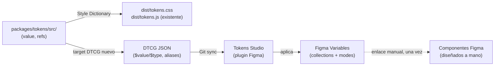

# ADR-009 — Figma como consumidor de tokens (export DTCG vía Tokens Studio)

- **Fecha**: 2026-06-09
- **Estado**: Propuesto
- **Dominio**: frontend / tokens
- **ADRs relacionados**: [ADR-003](ADR-003-arquitectura-design-tokens.md) (extiende, no reemplaza)

## Contexto

Surge la pregunta de si los tokens de `@romanmartinidev/tokens` pueden "pasarse a Figma" para tener "los componentes en Figma". Hay que separar dos cosas:

- **Tokens ≠ componentes.** El package distribuye **variables** (color, dimension, typography, shadow, motion, z-index, effect y "component tokens" que son sólo valores como `button.height.md`). En Figma eso se traduce a **Variables / Styles**, NO a componentes de Figma. El "dibujo" de un componente (capas, auto-layout, variantes, estados) se diseña a mano en Figma. La integración hace que **ese componente de Figma consuma las mismas variables que el código** — una única fuente de verdad para el valor —, pero no genera componentes de Figma desde el repo.

Esta decisión estaba **anticipada por ADR-003**:

- Su Opción D ("adoptar nomenclatura tipo Token Studio / sync con Figma") se descartó entonces y se postergó explícitamente: _"Mejor postergar a un ADR posterior si aparece motivación concreta (ej. sync bidireccional con Figma)."_
- En consecuencias negativas registró el gap de formato: _"El formato JSON propio de SD no es 100% W3C compatible: si alguna vez queremos sync … con Figma vía Tokens Studio (formato W3C), habrá un costo de transformación."_
- En acciones de seguimiento: _"Si aparece motivación real (multi-plataforma, sync Figma, fricción operativa), evaluar … en ADR futuro."_

Este ADR es ese ADR posterior.

Restricciones contextuales:

- **El código es la fuente de verdad de los tokens** (Style Dictionary en `packages/tokens/src/`). Lo establece ADR-003 y no se discute acá.
- **Gap de formato.** Las fuentes usan el formato clásico de Style Dictionary (`{ "value": "…" }`, referencias `{color.blue.500}`). Las herramientas de Figma esperan el formato **DTCG / W3C Design Tokens** (`$value`, `$type`). Hay que transformar.
- **Estructura theme/brand existente.** `dark`, `brand-a`, `brand-b` son capas de override de `semantic`. Eso mapea naturalmente al concepto de **modes** de las Variable Collections de Figma (aunque con una limitación de dimensionalidad, ver Consecuencias).
- No se asume plan Figma Enterprise.

Esta decisión introduce un **output nuevo en la superficie del package** y fija una **dirección de sincronización y una herramienta de proceso** del design system. Afecta cómo trabajan diseño y desarrollo en conjunto. Cumple el criterio de ADR (decisión de proceso transversal del DS, anticipada como one-way door por ADR-003).

## Opciones consideradas

### Opción A — Status quo (no integrar Figma)

Mantener sólo los outputs actuales (CSS + JS/TS). Diseño define valores aparte, a mano.

- **Pros**: cero trabajo nuevo; sin dependencias ni proceso adicional.
- **Contras**: dos fuentes de verdad de facto (los valores en código y los que el diseñador tipea en Figma) que derivan con el tiempo; el contraste/espaciado documentado en código no se refleja en los mockups. Es el problema que motiva la consulta.

### Opción B — Tokens Studio for Figma + export DTCG desde Style Dictionary (recomendada)

Agregar un target de Style Dictionary que emita los tokens en formato **DTCG** (`$value`/`$type`, aliases preservados). El plugin **Tokens Studio for Figma** lee ese DTCG (vía Git sync) y lo aplica a Variables de Figma. Dirección **one-way: code → Figma**.

- **Pros**:
  - Tokens Studio es el estándar de facto; maneja aliases (alias DTCG → alias de Variable en Figma) y modos.
  - DTCG es formato W3C estándar — futuro-prueba y no atado a un solo plugin.
  - No requiere plan Enterprise.
  - No toca build tool, jerarquía ni prefix de ADR-003: es **aditivo** (un target más).
  - Una sola fuente de verdad (el repo); Figma consume.
- **Contras**:
  - Nueva dependencia de proceso (el plugin) y un artefacto DTCG que mantener en el build.
  - Setup inicial en Figma (colecciones/modos, conectar Git, enlazar componentes a Variables) es trabajo manual de diseño, una vez.
  - Modos de Figma son unidimensionales por colección → `theme × brand` necesita modelado cuidadoso (ver Consecuencias).

### Opción C — Figma Variables REST API desde CI

Un target genera el payload y un job de CI lo `POST`ea a la API de Variables de Figma.

- **Pros**: code-first puro, automatizable, cero pasos manuales recurrentes.
- **Contras**: **escribir Variables por la API REST requiere plan Enterprise**; hay que mapear y mantener IDs de colecciones/modos/variables; más superficie de fallo. El costo no se justifica hoy.

### Opción D — Plugin de import manual de JSON

Exportar un JSON y subirlo a mano en un plugin de import de Variables.

- **Pros**: simple, gratis, sin requisitos de plan.
- **Contras**: manual cada vez (no hay sync); los imports suelen manejar mal aliases y modos. No escala como proceso.

### Opción E — Sincronización bidireccional (Figma como co-fuente de verdad)

Diseñadores editan Variables en Figma y exportan de vuelta a JSON; el repo y Figma se sincronizan en ambos sentidos.

- **Pros**: diseño edita tokens sin tocar el repo.
- **Contras**: **contradice ADR-003** (el código es la fuente de verdad); introduce conflictos de merge semánticos y ambigüedad sobre quién manda. Descartada por inconsistencia arquitectónica.

## Decisión

Se adopta la **Opción B**, formalizada en tres decisiones:

### 1. Dirección: **code → Figma (one-way)**

El repositorio es la única fuente de verdad de los tokens (coherente con ADR-003). Figma es **consumidor**. Los valores fluyen del build hacia las Variables de Figma; nunca al revés de forma automática. Si diseño necesita un valor nuevo, se propone como cambio de tokens en el repo (flujo normal del package).

### 2. Herramienta: **Tokens Studio for Figma**, alimentado por **Git sync**

El plugin Tokens Studio lee el artefacto DTCG desde el repositorio. No se asume plan Enterprise. La API REST de Variables (Opción C) queda como evaluación futura si el volumen de sincronización manual se vuelve fricción real.

### 3. Formato: **DTCG (W3C) emitido por un target nuevo de Style Dictionary, con aliases preservados**

- Se agrega un **target/platform adicional** en `packages/tokens/sd.config.mjs` que emite los tokens en formato **DTCG** (`$value`, `$type`).
- Las **referencias se preservan como aliases** DTCG (`{color.blue.500}`), **no** se resuelven a valores crudos: así la cadena `component → semantic → primitive` se reconstruye en Figma como **Variables que apuntan a Variables** (el valor central de la integración).
- Los **temas** (`dark`, `brand-a`, `brand-b`) se emiten como sets diferenciados para mapear a **modes** de Figma.
- **No se cambia** el build tool, la jerarquía `primitives → semantic → component → theme`, el prefix `--ds-*`, ni los outputs CSS/JS existentes. El DTCG es **aditivo**.

El detalle de implementación (mecanismo de transformación DTCG, layout de archivos, path versionado para el Git sync, mapeo exacto de modos, scope del primer corte) vive en el `design.md` del change `tokens-figma-export` (`aaa-012`), no en este ADR.

## Consecuencias

### Positivas

- **Una sola fuente de verdad**: el valor del color/espaciado/etc. vive en el repo; Figma lo refleja. Se elimina la deriva entre mockups y código.
- **Aliases preservados**: el sistema semántico (`bg.primary → blue.500`) se reconstruye como Variables encadenadas en Figma; cambiar un primitive propaga a todo lo que lo referencia, igual que en CSS.
- **Aditivo y reversible**: es un target más de Style Dictionary; quitar la integración es borrar ese target. No es one-way door en su implementación (sí lo es la elección de dirección/herramienta como proceso, por eso el ADR).
- **Estándar y portable**: DTCG es formato W3C; si Tokens Studio dejara de servir, el mismo JSON alimenta otra herramienta.
- **No-Enterprise**: viable con planes estándar de Figma.

### Negativas / trade-offs aceptados

- **Nueva dependencia de proceso**: el plugin Tokens Studio y su configuración de Git sync pasan a ser parte del flujo del DS (documentar en README del package).
- **Artefacto DTCG a mantener en el build**: un output más que versionar/publicar y validar en CI (que no derive del CSS/JS).
- **Modos unidimensionales en Figma**: una Variable Collection tiene una sola dimensión de modos. `theme (light/dark) × brand (a/b)` es bidimensional. El primer corte resuelve una dimensión (theme) como modos; la combinación con brand se modela con sets/colecciones adicionales o queda como limitación documentada. Decisión fina en `design.md`.
- **Los componentes de Figma no se generan**: siguen siendo trabajo de diseño manual; la integración sólo provee las Variables que esos componentes consumen. Expectativa a comunicar explícitamente.
- **Setup inicial manual en Figma**: crear colecciones, conectar Git y enlazar componentes a Variables es trabajo de una vez del lado diseño.

### Acciones de seguimiento

- Implementar el target DTCG y la validación en el change `tokens-figma-export` (`aaa-012`).
- Documentar en `packages/tokens/README.md` cómo conectar Tokens Studio al repo y la convención de modos.
- Si la sincronización manual vía plugin se vuelve fricción, reevaluar la API REST de Variables (Opción C) en un ADR futuro.
- Al **aceptar** esta decisión (cierre del change), promover el estado de este ADR a `Aceptado` y agregar la fila correspondiente en `decisions-log.md`.
