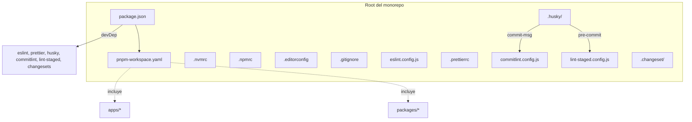
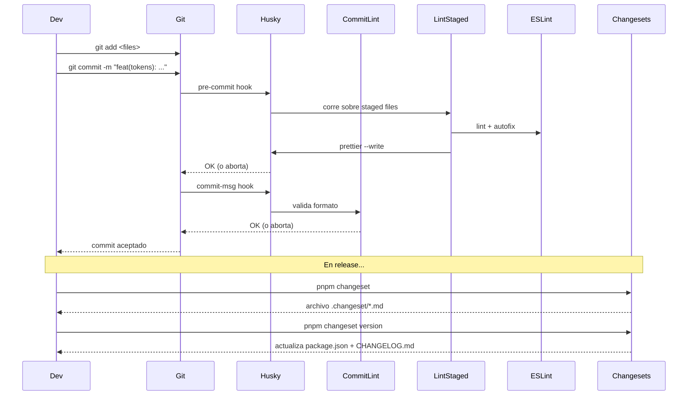

# Diseño técnico — Bootstrap Fase 1

## Technical approach

Configuración mínima viable de un monorepo `pnpm` orientado a publicación de librerías frontend. Todas las herramientas se eligen por ser **estándar del ecosistema** (no opinadas, baja curva, alta adopción) salvo donde se documenta lo contrario.

## Architecture decisions

### 1. Package manager: pnpm workspaces

**Por qué pnpm y no npm/yarn:**

- Almacenamiento eficiente (content-addressable store) → cero duplicación cross-workspace.
- `strict-peer-dependencies=true` por default → detecta mismatches que npm tolera silenciosamente.
- Protocolo `workspace:*` nativo → dependencias internas seguras.
- Adoptado por la mayoría de monorepos frontend modernos (Vite, Vue, Astro, Svelte usan pnpm).

**Trade-off aceptado:** menos ubicuo que npm en CI hostings antiguos. Mitigación: la versión de pnpm queda fija vía `packageManager` en `package.json`.

Se materializará en **ADR-001**.

### 2. Versión de Node: fijar via `.nvmrc`

**Decisión**: Node 22 LTS (alineado con Angular 21, soporte hasta 2027).

`.nvmrc` + `engines.node` en cada `package.json` + `engine-strict=true` en `.npmrc`. Con `nvm use` automático en shells configurados, evita "funciona en mi máquina".

### 3. Conventional Commits + commitlint + Husky + lint-staged

**Por qué Conventional Commits:**

- Habilita Changesets/changelog auto.
- Estándar adoptado por Angular, Conventional Changelog, semantic-release, etc.
- Bajo costo cognitivo (`feat`, `fix`, `chore`...).

**commitlint** valida el formato en el hook `commit-msg`. **lint-staged** corre ESLint/Prettier solo sobre archivos staged en el hook `pre-commit` (rápido, no bloquea por archivos no tocados).

Se materializará en **ADR-002**.

### 4. Changesets para versionado

**Por qué Changesets y no semantic-release:**

- Diseñado para **monorepos** (decisiones de versión por package, no por commit).
- El developer elige el bump (`patch`/`minor`/`major`) explícitamente — control manual sobre la semver.
- Maneja `workspace:*` correctamente al publicar (los reescribe a versiones reales).
- Adoptado por React, Astro, Remix, Svelte, etc.

**Trade-off aceptado:** requiere disciplina de agregar un changeset por PR. Mitigación: workflow CI futuro (Fase 5) lo verifica.

Se materializará en **ADR-002** (combinada con Conventional Commits).

### 5. ESLint + Prettier compartidos en root

**Decisión**: configs base en root, cada package extiende. ESLint corre lógica de TypeScript/Angular, Prettier solo formato. Cero solapamiento (Prettier excluido de reglas ESLint vía `eslint-config-prettier`).

Angular 21 incluye `@angular-eslint/*` nativamente, lo que cubre `packages/components` y `apps/playground` cuando se generen.

### 6. Borrar `angular-app/` antes de instalar

**Decisión**: borrar la carpeta completa en esta fase. Razón: el `angular-app/` actual tiene `node_modules` propio, lockfile propio (npm) y configuración que no encaja en workspaces. Mantenerlo durante Fase 1 generaría conflictos en `pnpm install`. Se regenera limpio en Fase 4.

## Data flow

## File changes

### Nuevos archivos en root

| Archivo                  | Propósito                                                                                                           |
| ------------------------ | ------------------------------------------------------------------------------------------------------------------- |
| `package.json`           | Root del monorepo. `"private": true`. `packageManager: "pnpm@x.y.z"`. devDeps compartidas. Scripts agregados.       |
| `pnpm-workspace.yaml`    | `packages:\n  - 'packages/*'\n  - 'apps/*'`                                                                         |
| `.nvmrc`                 | `22` (Node 22 LTS).                                                                                                 |
| `.npmrc`                 | `engine-strict=true`, `auto-install-peers=true`, `strict-peer-dependencies=true`, `prefer-workspace-packages=true`. |
| `.editorconfig`          | UTF-8, LF, indent 2 spaces, final newline.                                                                          |
| `.gitignore`             | `node_modules/`, `dist/`, `.angular/`, `coverage/`, `*.log`, `.DS_Store`, `.changeset/.changeset-meta`, etc.        |
| `eslint.config.js`       | Flat config base. TS estricto, sin reglas redundantes con Prettier.                                                 |
| `.prettierrc`            | `printWidth: 100`, `singleQuote: true`, `trailingComma: 'all'`. Alineado al estilo previo de `angular-app/`.        |
| `.prettierignore`        | `dist/`, `node_modules/`, `.changeset/`, `pnpm-lock.yaml`.                                                          |
| `commitlint.config.js`   | `extends: ['@commitlint/config-conventional']`.                                                                     |
| `lint-staged.config.js`  | `*.{ts,js}: eslint --fix && prettier --write`, `*.{md,json,yaml,yml}: prettier --write`.                            |
| `.husky/pre-commit`      | `pnpm lint-staged`.                                                                                                 |
| `.husky/commit-msg`      | `pnpm commitlint --edit $1`.                                                                                        |
| `.changeset/config.json` | Config: `access: "public"`, `baseBranch: "main"`, `updateInternalDependencies: "patch"`.                            |
| `LICENSE`                | MIT, año 2026, autor "Roman Martini".                                                                               |
| `README.md`              | Punto de entrada del repo: qué es, structure, getting started, links a docs.                                        |
| `CONTRIBUTING.md`        | Flujo de PR, Conventional Commits, Changesets, ejecución local.                                                     |

### Archivos modificados

| Archivo                              | Cambio                                                                            |
| ------------------------------------ | --------------------------------------------------------------------------------- |
| `docs/architecture/decisions-log.md` | Reemplazar "pendiente ADR-001" y "pendiente ADR-002" con links reales a los ADRs. |
| `docs/bootstrap-plan.md`             | Marcar Fase 1 como completada.                                                    |
| `.gitignore` (existente, 13 bytes)   | Reemplazado por versión completa.                                                 |

### Nuevos archivos en docs

| Archivo                                                            | Propósito                                                |
| ------------------------------------------------------------------ | -------------------------------------------------------- |
| `docs/architecture/adr/ADR-001-monorepo-pnpm-workspaces.md`        | Decisión formal sobre pnpm workspaces.                   |
| `docs/architecture/adr/ADR-002-conventional-commits-changesets.md` | Decisión formal sobre Conventional Commits + Changesets. |

### Archivos eliminados

| Archivo                             | Razón                                                                                                          |
| ----------------------------------- | -------------------------------------------------------------------------------------------------------------- |
| `angular-app/` (carpeta completa)   | Se regenera limpio en Fase 4. Tiene `node_modules` y lockfile npm que entran en conflicto con pnpm workspaces. |
| `packages/tokens/node_modules/`     | Re-instalado desde root vía pnpm.                                                                              |
| `packages/tokens/package-lock.json` | Reemplazado por `pnpm-lock.yaml` único en root.                                                                |

## Riesgos identificados

| Riesgo                                                              | Mitigación                                                                                              |
| ------------------------------------------------------------------- | ------------------------------------------------------------------------------------------------------- |
| Borrar `angular-app/` pierde stories ya escritas                    | Backup explícito de `angular-app/src/stories/` en `docs/_archive/angular-app-stories/` antes de borrar. |
| `pnpm install` falla por incompatibilidad de Angular 21 con Node 22 | Validación temprana: probar `pnpm install` con un workspace mínimo antes de migrar tokens.              |
| `tokens/sd.config.mjs` rompe por nueva versión de pnpm              | No se modifica en esta fase; build se valida en Fase 2.                                                 |
| ADRs quedan a medias por falta de input                             | ADR-001 y ADR-002 son decisiones ya tomadas — el ADR documenta, no decide.                              |

## Validación de cierre

Antes de marcar la fase como completa:

1. `pnpm install` desde root pasa sin errores.
2. Un commit dummy `chore: test commitlint` se rechaza por commitlint **(esperado: debe rechazar el subject sin scope o pasar si está bien formado)**.
3. Un commit válido `chore: bootstrap fase 1` pasa.
4. `pnpm changeset` muestra el prompt interactivo correctamente.
5. ADR-001 y ADR-002 están aceptados, linkados en `decisions-log.md`.
6. `docs/bootstrap-plan.md` marca Fase 1 ✅.
