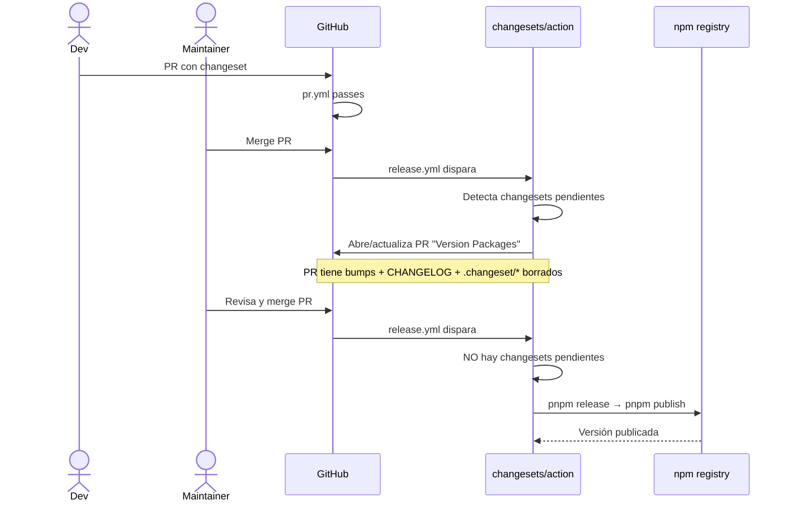

## Context

Fase 5 cierra el bootstrap del monorepo agregando el pipeline de CI/CD. El repo ya tiene todo el plumbing local (pnpm + workspaces + Changesets + commitlint + Husky + Vitest + ng-packagr + Style Dictionary), pero **nada de eso se valida en CI**: cualquier PR puede mergear con build roto, tests rotos, format incorrecto, openspec inválido, o sin changeset.

Restricciones del stack heredadas:

- Repo en GitHub (decidido en Fase 0).
- pnpm workspaces (CHG-001, ADR-001).
- Changesets configurado pero no usado todavía (CHG-001, ADR-002).
- Vitest + ng-packagr + Style Dictionary builds + OpenSpec validate ya funcionan localmente.

Decisiones tomadas en kickoff:

1. **Scope mínimo viable**: solo PR validation + release. Sin Storybook deploy, sin a11y CI, sin bundle budget, sin visual regression (todos como follow-ups).
2. **Storybook deploy**: postergado a `playground-storybook-deploy` (change futuro).
3. **Modelo de release**: Changesets abre PR de release; merge dispara publish (no auto-publish al merge a main).
4. **Branch protection**: documentado en CONTRIBUTING.md como checklist para el mantenedor (no se configura por código).

## Goals / Non-Goals

**Goals:**

- Dos workflows GitHub Actions funcionales: `pr.yml` (validation) + `release.yml` (release con Changesets).
- Enforcement de changeset obligatorio en PRs que tocan `packages/*`.
- Cache de pnpm habilitado para velocidad.
- Versión de Node leída de `.nvmrc` (sin hardcode).
- ADR-006 formaliza la decisión.
- Branch protection documentada en CONTRIBUTING.md.

**Non-Goals:**

- NO setear Storybook deploy.
- NO a11y CI con axe.
- NO bundle budget con size-limit.
- NO visual regression (Chromatic o Playwright).
- NO publicar packages a npm en esta fase (el workflow queda LISTO pero el `NPM_TOKEN` y el primer release los maneja el mantenedor cuando quiera).
- NO matrix de Node (solo la versión de `.nvmrc`).
- NO matrix de OS (solo Ubuntu).
- NO Compodoc deploy.
- NO validar título del PR contra Conventional Commits (los commits internos ya están validados por commitlint local).

## Decisions

### 1. Provider: **GitHub Actions**

**Alternativas:**

- **A. GitHub Actions (Recomendado y adoptado).** El repo está en GitHub. Integración nativa con PRs, status checks, secrets, branch protection.
- B. CircleCI / Travis / etc. — requeriría integración con GitHub externa, más overhead.
- C. Self-hosted runner — innecesario a esta escala.

**Decisión: A.**

### 2. Workflows: **dos** — `pr.yml` y `release.yml`

**Alternativas:**

- **A. Dos workflows (Recomendado y adoptado).** Separa concerns: PR es validation pura; release es release pura. Triggers distintos (`pull_request` vs `push`).
- B. Un solo workflow con condicionales. Más compacto pero más complejo de leer y debuggear.

**Decisión: A.** Patrón estándar del ecosistema npm (lo usan React, Vue, Astro, Remix, etc.).

### 3. Modelo de release: **Changesets abre PR; merge dispara publish**

Flow:



**Por qué este modelo vs auto-publish**:

- Da un **checkpoint humano** antes de publicar a npm (revisión del CHANGELOG + versiones).
- Permite agrupar varios PRs antes de release (acumular changesets, mergear el PR de release una vez con todos los bumps).
- Estándar del ecosistema npm (Astro, Remix, Storybook, TanStack lo usan así).
- Pre-1.0 vital — la superficie API puede cambiar y querés revisar antes de publicar.

### 4. Enforcement de changeset: **path-based + status check**

**Approach**:

- Detectar archivos modificados con `git diff origin/main`.
- Si hay matches en `packages/*` (excluyendo `packages/*/README.md`), verificar que existe al menos un nuevo `.changeset/*.md` en el diff.
- Si falla, exit 1 con mensaje claro: `pnpm changeset`.

**Por qué path-based vs algún plugin de Changesets**:

- `changesets/action` tiene un flag para esto pero solo en el workflow de release.
- En `pr.yml` necesitamos validación temprana (antes del merge).
- Script bash custom es ~10 líneas, sin dep extra.

**Excepciones documentadas**:

- PRs que solo tocan README de un package no requieren changeset (cambio doc, no API).
- PRs que solo tocan `docs/`, `openspec/`, `.github/`, `CONTRIBUTING.md`, etc. no requieren changeset.

### 5. Cache: `setup-node` con `cache: 'pnpm'`

`actions/setup-node@v4` tiene cache nativo desde finales 2023. Usar `cache: 'pnpm'` + `cache-dependency-path: 'pnpm-lock.yaml'`.

**Métricas esperadas**:

- Cold install (sin cache): ~2-3 min.
- Warm install (cache hit): ~20-40 seg.

### 6. Versión de Node: `node-version-file: '.nvmrc'`

NO hardcodear `node-version: '22'` en el YAML. Leer de `.nvmrc`. Cambiar Node en un solo lugar.

### 7. Composite action para setup compartido

Crear `.github/actions/setup/action.yml` con:

- Checkout (NO — el checkout queda en el workflow porque necesita `fetch-depth: 0` para Changesets).
- Setup pnpm.
- Setup node con cache.
- `pnpm install --frozen-lockfile`.

**Por qué composite y no script bash compartido**:

- Composite actions son YAML, no requieren shell script aparte.
- Reutilizable en ambos workflows con `uses: ./.github/actions/setup`.
- Si en el futuro agregamos más workflows (storybook deploy, a11y CI), reutilizan la setup.

### 8. Lint de workflows con `actionlint` local

NO incluir actionlint en el CI mismo (es overkill para este scope). Pero documentar en CONTRIBUTING.md que devs pueden correrlo localmente antes de pushear cambios a workflows:

```bash
docker run --rm -v "$(pwd):/repo" -w /repo rhysd/actionlint:latest -color
```

### 9. Branch protection: documentada, no automatizada

Las branch protection rules se configuran en GitHub UI (Settings → Branches → Add rule). NO se aplican por código (require `terraform` + GitHub provider o similar — overkill).

**Checklist documentado en CONTRIBUTING.md**:

- Require pull request reviews before merging.
- Require status checks to pass before merging: `pr.yml`.
- Require branches to be up to date before merging.
- Require linear history (opcional pero recomendado).
- Do not allow bypassing the above settings.
- Restrict force pushes y deletions.

### 10. Secrets

- **NPM_TOKEN**: scope `@romanmartinidev` con permiso publish. Configurado por mantenedor en Settings → Secrets and variables → Actions → New repository secret.
- **GITHUB_TOKEN**: provisto automáticamente por GitHub Actions, NO requiere setup manual.

## Risks / Trade-offs

| Riesgo                                                             | Mitigación                                                                                               |
| ------------------------------------------------------------------ | -------------------------------------------------------------------------------------------------------- |
| **Workflows con bugs publican versión incorrecta**                 | Modelo de PR de release con checkpoint humano. Vos revisás el CHANGELOG antes de mergear y publicar.     |
| **NPM_TOKEN expira o se revoca**                                   | Documentar en CONTRIBUTING.md cómo regenerar. Workflow falla con error claro si falta.                   |
| **Cache de pnpm corrupta puede dar builds inconsistentes**         | `--frozen-lockfile` previene cambios en deps. Si pasa, invalidar cache manualmente en GitHub Actions UI. |
| **changesets/action puede tener breaking changes en patches**      | Pinear versión major (`changesets/action@v1`). Monitorear releases.                                      |
| **Path-based changeset check tiene falsos negativos/positivos**    | Mantener regex simple + documentar excepciones. Si causa fricción, refinar.                              |
| **Sin matrix de Node = no detectamos issues en otras versiones**   | Aceptado para Fase 5. Si publicamos para soportar Node ≥22 only, no necesitamos matrix.                  |
| **Workflows yamlbomb (errores de sintaxis YAML) bloquean a todos** | Validar con actionlint antes de push (documentado).                                                      |
| **GitHub Actions outages**                                         | Aceptado — todos los providers tienen outages. GH Actions tiene 99.9% uptime histórico.                  |

## Migration Plan

### Para el repo (cómo aplicar la fase)

Ver `tasks.md`. Sin downtime. El workflow se activa la próxima vez que alguien abra un PR o pushee a main.

### Para los releases existentes

No aplica — todavía no hay releases. El primer release lo hace el mantenedor cuando esté listo:

1. Crear changesets para todo lo bumpeable (tokens v0.1.0, components v0.1.0).
2. Mergear a main.
3. Workflow abre PR "Version Packages".
4. Mantenedor mergea.
5. Workflow corre `pnpm release` → publica.

## Open Questions

- **¿Cuándo hacer el primer release real (v0.1.0 de tokens + components)?** Diferido al mantenedor. La fase 5 deja el pipeline LISTO, no obliga a hacer el primer release ahora.
- **¿Configurar `provenance: true` en publish para supply chain security?** [Sigstore provenance](https://docs.npmjs.com/generating-provenance-statements) es buena práctica pero requiere setup adicional. Diferido a follow-up `ci-supply-chain-security`.
- **¿Matrix de Node 22 + 24?** Hoy no — solo soportamos Node ≥22.12. Si en el futuro queremos soportar más versiones, se agrega matrix sin breaking.
- **¿Validar título del PR contra Conventional Commits?** El squash-merge default de GitHub usa el título del PR como mensaje de commit. Si no se valida el título, un PR con título arbitrario rompe la convención al mergear. Diferido a `ci-pr-title-validation`.
